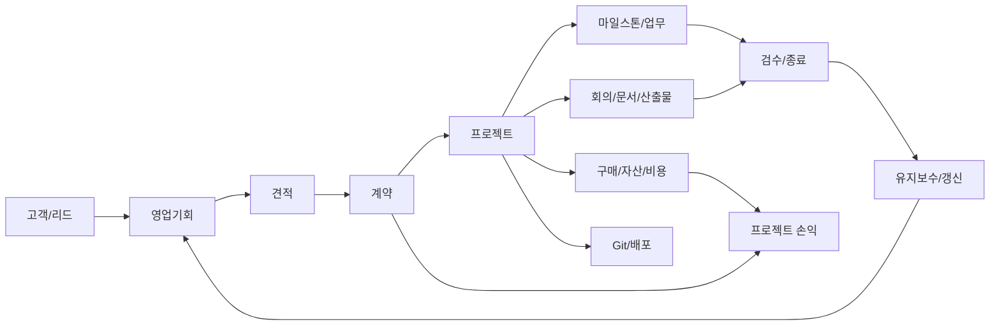
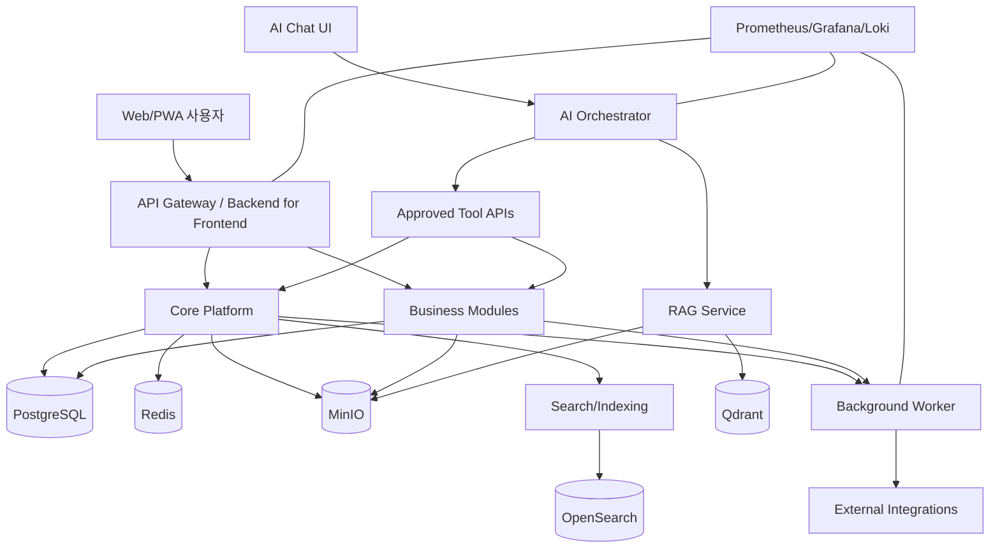

# Luminode ERP Platform 마스터 상세설계

- 문서 상태: Approved Baseline
- 승인일: 2026-08-05
- 대상 조직: 현재 10명 이하, 최대 30명
- 배포 형태: 사내 자체 서버(Self-hosted)
- 기본 언어/통화/시간대: 한국어 / KRW / Asia/Seoul
- 제품 코드명: LEP(Luminode ERP Platform)

---

## 1. 제품 정의

LEP는 프로젝트형 AI·SI 기업의 영업, 계약, 프로젝트 수행, 산출물, 구매, 자산, 비용, 인사, 결재, 지식, 개발 활동을 하나의 데이터 모델로 연결하는 사내 운영 플랫폼이다.

핵심 목표는 메뉴 수를 늘리는 것이 아니라 다음 세 가지를 달성하는 것이다.

1. **한 번 입력한 정보의 재사용**: 고객·프로젝트·계약·업무·문서·비용 정보를 중복 입력하지 않는다.
2. **업무 흐름의 추적 가능성**: 누가, 언제, 무엇을, 왜 변경했는지 확인할 수 있다.
3. **AI가 안전하게 업무를 보조**: 검색·요약·초안·점검·등록 제안을 수행하되 중요한 실행은 승인 후 반영한다.

---

## 2. 설계 범위

### 2.1 포함 모듈

- 통합 대시보드
- 조직·사용자·권한
- 고객·담당자·CRM
- 리드·영업기회·활동
- 견적·계약·갱신
- 프로젝트·마일스톤·업무·이슈·리스크
- 일정·회의·회의록
- 문서·산출물·버전·지식·위키
- 전자결재·품의·지출·출장·휴가
- 구매요청·발주·입고·거래처
- 재고·자산·대여·점검·폐기
- 매출·매입·비용·프로젝트 손익
- 인사·근태·휴가·교육·평가 기초
- 알림·댓글·멘션·활동 피드
- Git 저장소·이슈·PR·배포 연동
- 서버·GPU·서비스 상태 모니터링
- 검색·RAG·AI 에이전트
- 관리자·감사·백업·보존 정책

### 2.2 초기 비범위

다음 기능은 자체 구현보다 외부 전문 시스템 연동을 우선한다.

- 법정 회계 원장 및 결산
- 급여 계산과 원천세 신고
- 전자세금계산서 국세청 직접 발행
- 공인전자서명·법적 등기
- 은행 이체 실행
- 완전한 사내 메신저/화상회의 대체
- 복잡한 제조 MRP·BOM·생산계획

ERP 내부에는 필요한 관리 장부와 연결 키를 유지하되, 법적 원장은 외부 시스템을 기준으로 삼는다.

---

## 3. 핵심 사용자

| 사용자 유형 | 주요 목적 | 대표 권한 |
|---|---|---|
| 대표/경영진 | 전사 현황, 손익, 위험, 승인 | 전사 조회, 최종 승인 |
| 관리자 | 사용자·권한·기준정보·감사 | 시스템 설정, 권한 관리 |
| PM/팀장 | 프로젝트 일정·인력·산출물·비용 관리 | 프로젝트 편집, 업무 배정, 1차 승인 |
| 일반 직원 | 업무 수행, 문서 작성, 일정, 비용 신청 | 본인 및 참여 프로젝트 편집 |
| 영업 담당 | 고객·영업기회·견적·계약 관리 | CRM/영업 편집 |
| 회계/경영지원 | 지출·구매·증빙·정산·자산 관리 | 재무·구매·자산 편집 |
| 외부 협력자 | 제한된 프로젝트 자료·업무 접근 | 초대된 공간만 접근 |
| AI 서비스 계정 | 승인된 도구 실행 | 최소 권한, 범위 제한, 전 행동 감사 |

소규모 조직이므로 한 사용자가 여러 역할을 동시에 가질 수 있다.

---

## 4. 제품 설계 원칙

### 4.1 프로젝트 중심 연결

대부분의 업무 엔터티는 선택적으로 `project_id`를 가진다. 영업기회가 수주되면 계약과 프로젝트가 연결되고, 이후 발생한 업무·회의·문서·구매·비용·개발 활동이 같은 프로젝트 타임라인에 모인다.

### 4.2 모듈형 모놀리스 우선

초기에는 하나의 백엔드 배포 단위 안에서 도메인 모듈을 명확히 분리한다. 30명 규모에서는 마이크로서비스의 운영 복잡성이 이점보다 크다. 향후 파일 처리, 검색, AI 추론, 알림 작업처럼 자원 특성이 다른 부분만 별도 서비스로 분리할 수 있다.

### 4.3 데이터베이스는 하나, 소유권은 모듈별

PostgreSQL을 기본 트랜잭션 저장소로 사용한다. 각 테이블에는 소유 모듈이 있으며, 다른 모듈은 해당 모듈의 서비스 인터페이스 또는 읽기 전용 조회 모델을 통해 접근한다.

### 4.4 삭제보다 상태 전이

계약, 결재, 비용, 자산, 인사, 문서 버전은 원칙적으로 물리 삭제하지 않는다. 취소·무효·보관 상태를 사용하고, 모든 변경을 감사 로그에 남긴다.

### 4.5 AI는 직접 DB를 수정하지 않음

AI 에이전트는 도구 API를 호출한다. 도구 API는 일반 사용자와 동일한 권한, 검증, 감사 규칙을 적용한다. 금전, 계약, 인사, 권한, 대량 변경, 외부 발송, 영구 삭제는 승인 요청을 생성한 뒤 사람의 확인을 받아 실행한다.

### 4.6 외부 연동 실패가 핵심 업무를 막지 않음

Git, 이메일, 캘린더, 회계 서비스 연동이 중단되어도 프로젝트·업무·문서·결재의 핵심 기능은 계속 작동해야 한다. 연동 작업은 재시도 큐와 실패 보관함을 가진다.

---

## 5. 전체 업무 흐름



---

## 6. 논리 아키텍처



---

## 7. 상위 모듈 경계

| 영역 | 소유 책임 | 다른 모듈에 제공하는 핵심 인터페이스 |
|---|---|---|
| Core/IAM | 조직, 사용자, 역할, 권한, 감사 | 인증 주체, 권한 판정, 기준정보 |
| Collaboration | 댓글, 멘션, 알림, 활동 피드 | 공통 협업 기능 |
| CRM/Sales | 고객, 담당자, 리드, 영업기회 | 고객/기회 조회, 수주 전환 |
| Contract | 견적, 계약, 갱신, 조건 | 계약 상태, 금액, 기간 |
| Project | 프로젝트, 마일스톤, 업무, 리스크 | 프로젝트 상태, 참여자, 진행률 |
| Meeting/Calendar | 일정, 회의, 회의록, 액션아이템 | 일정·회의 조회, 업무 전환 |
| DMS/Knowledge | 파일, 문서, 버전, 산출물, 위키 | 파일 링크, 문서 메타데이터, 검색 소스 |
| Approval/Workflow | 결재 양식, 결재선, 상태 전이 | 승인 요청, 결과 이벤트 |
| Procurement | 구매요청, 발주, 입고, 공급사 | 구매 상태, 자산화 대상 |
| Asset/Inventory | 자산, 재고, 대여, 점검 | 보유·할당·이력 |
| Finance | 비용, 매출, 매입, 예산, 손익 | 프로젝트 재무 요약 |
| HR | 직원, 근태, 휴가, 교육, 평가 | 재직 상태, 가용 인력 |
| DevOps Integration | 저장소, 이슈, PR, 배포 | 개발 활동 요약 |
| Infra Monitoring | 서버, 서비스, GPU, 알림 | 상태·장애 이벤트 |
| AI Platform | RAG, 에이전트, 도구, 승인, 평가 | 자연어 업무 인터페이스 |
| Analytics | KPI, 스냅샷, 리포트 | 역할별 대시보드 |

---

## 8. 기술 기준안

| 계층 | 기준 기술 | 선택 이유 |
|---|---|---|
| Web | Next.js + TypeScript | 에이전트 친화적 타입 시스템, SSR/PWA 지원 |
| UI | Tailwind CSS + 컴포넌트 라이브러리 | 일관된 화면과 빠른 구현 |
| Backend | FastAPI + Python | AI 서비스와의 통합, 명확한 OpenAPI |
| ORM/Migration | SQLAlchemy + Alembic | 트랜잭션과 스키마 변경 관리 |
| DB | PostgreSQL | 관계형 트랜잭션, JSONB, 검색 확장성 |
| Cache/Queue | Redis + 작업 큐 | 캐시, 잠금, 비동기 작업, 재시도 |
| Object Storage | MinIO | 사내 구축 가능한 S3 호환 파일 저장소 |
| Search | OpenSearch | 전문 검색, 필터, 감사·로그 검색 |
| Vector DB | Qdrant | 문서 임베딩과 메타데이터 필터 |
| LLM Serving | OpenAI 호환 게이트웨이 + 로컬 추론 서버 | 모델 교체와 외부/내부 모델 혼용 |
| Deployment | Docker Compose 우선 | 30명 규모에 적합한 운영 단순성 |
| Scale-up | 필요 시 k3s | 다중 노드와 무중단 운영이 필요할 때만 전환 |
| Monitoring | Prometheus + Grafana + Loki | 메트릭, 대시보드, 로그 통합 |
| Secrets | SOPS 또는 Vault 계열 | 저장소와 비밀정보 분리 |

기술명은 기준안이며, 세부 버전은 구현 시작 시 호환성 검증 후 고정한다.

---

## 9. 주요 비기능 요구사항

### 9.1 성능

- 일반 목록/상세 API: 사내망 기준 p95 500ms 이내 목표
- 검색: p95 2초 이내 목표
- 대시보드: 첫 의미 있는 화면 3초 이내 목표
- 대용량 파일 업로드: 분할 업로드와 재개 지원
- AI 요청: 비동기 처리, 진행 상태, 취소 지원

### 9.2 가용성

- 업무시간 기준 월 가용성 목표 99.5%
- 핵심 데이터 RPO 24시간 이하, 권장 4시간
- 핵심 서비스 RTO 4시간 이하
- 검색·AI 장애 시에도 CRUD·결재·문서 다운로드는 유지

### 9.3 보안

- 모든 요청 인증 및 권한 검사
- 서버·브라우저 간 TLS
- 중요정보 필드 암호화 또는 마스킹
- MFA 선택 적용, 관리자·재무 권한은 MFA 권장
- AI 입력 전 민감정보 정책 적용
- 감사 로그는 일반 관리자가 수정·삭제할 수 없음

### 9.4 접근성·사용성

- 반응형 웹 우선
- 키보드 탐색과 명확한 포커스
- 한국어 날짜·금액 표기
- 상태는 색상만으로 구분하지 않음
- 모든 자동화는 실행 전/후 결과를 확인할 수 있음

---

## 10. 상태 모델 공통 규칙

모든 핵심 엔터티는 임의의 문자열 상태를 사용하지 않고 명시된 상태 머신을 가진다.

예시:

```text
Draft → Submitted → InReview → Approved → Executed → Closed
                 ↘ Rejected
Draft/Submitted → Cancelled
Closed → Archived
```

- 상태 전이는 권한과 조건을 검증한다.
- 상태 변경은 `activity_log`와 `audit_log`에 기록한다.
- 승인된 문서를 수정할 때는 새 버전 또는 변경 결재를 생성한다.

---

## 11. 단계별 활성화 원칙

전체 모듈의 데이터·권한·연결 구조는 처음부터 설계하지만, 다음 순서로 실제 사용을 시작한다.

1. 기반 플랫폼 + 프로젝트 + 업무 + 문서 + 일정 + 결재
2. CRM + 영업 + 견적 + 계약
3. 구매 + 비용 + 자산 + 프로젝트 손익
4. 인사 + 근태 + 휴가 + 평가 기초
5. 검색 + RAG + AI 에이전트 자동화
6. Git/서버/외부 회계·캘린더·메일 연동 고도화

각 단계는 이전 단계의 운영 데이터가 안정된 후 활성화한다.

---

## 12. 성공 기준

- 프로젝트 관련 핵심 정보의 90% 이상을 ERP에서 조회 가능
- 주간업무보고 작성 시간 50% 이상 단축
- 승인·구매·지출 처리 상태를 별도 문의 없이 확인 가능
- 산출물 누락·계약 갱신·업무 지연 알림 자동화
- 프로젝트별 계약금액·비용·예산을 단일 화면에서 조회
- AI가 생성한 실행 제안 중 승인·거절·수정 이력이 전부 추적 가능
- 파일 서버, 개인 PC, 메신저에 흩어진 최신본 혼선을 현저히 감소

---

## 13. 주요 위험과 통제

| 위험 | 영향 | 통제 |
|---|---|---|
| 처음부터 너무 많은 기능 구현 | 장기화, 사용 실패 | 전체 설계/단계별 활성화, MVP 게이트 |
| 사용자 입력 부담 | 데이터 누락 | 기본값, 자동 연결, 템플릿, AI 초안 |
| AI 오작동 | 잘못된 변경·발송 | 승인형 실행, 최소 권한, 미리보기, 감사 |
| 자체 서버 장애 | 업무 중단 | 오프사이트 백업, 복구 훈련, 모니터링 |
| 권한 설계 과복잡 | 운영 어려움 | 역할 기반 기본 + 예외 범위만 제한적 적용 |
| 회계·급여 법적 오류 | 재무·법적 위험 | 전문 시스템 연동, ERP는 관리 장부 역할 |
| 에이전트 병렬 개발 충돌 | 코드·DB 불일치 | 모듈 소유권, 계약 우선, 마이그레이션 규칙 |

---

## 14. 승인 요청 항목

본 설계의 기준 가정은 다음과 같다.

1. 웹/PWA를 우선하고 네이티브 모바일 앱은 후순위로 둔다.
2. 초기 배포는 Docker Compose 기반 단일 사내 서버로 시작한다.
3. ERP 자체 회계·급여는 관리 기능에 한정하고 법정 처리는 외부 시스템과 연동한다.
4. 사내 메신저 완전 대체보다 프로젝트 댓글·멘션·알림을 우선한다.
5. AI의 중요 실행은 항상 사람 승인 후 수행한다.
6. 전체 기능은 설계하되 실제 운영 전환은 단계적으로 진행한다.

---
