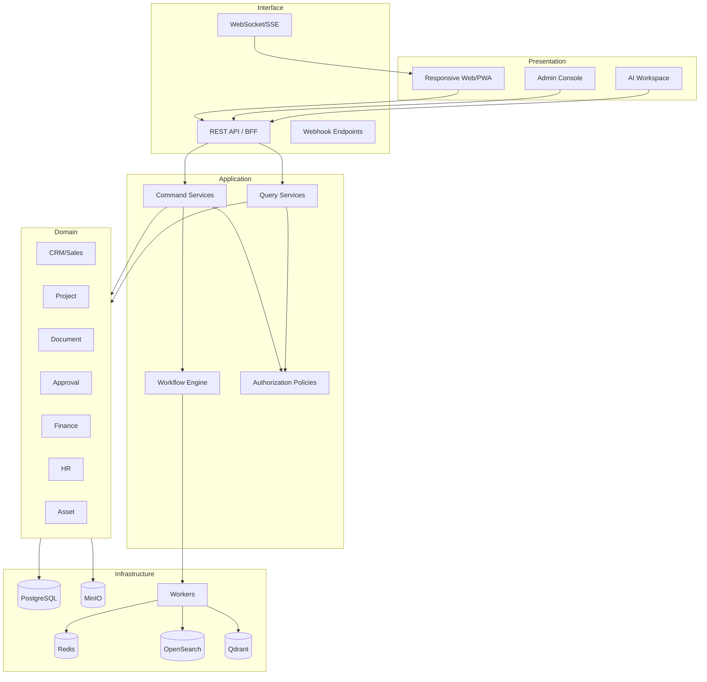
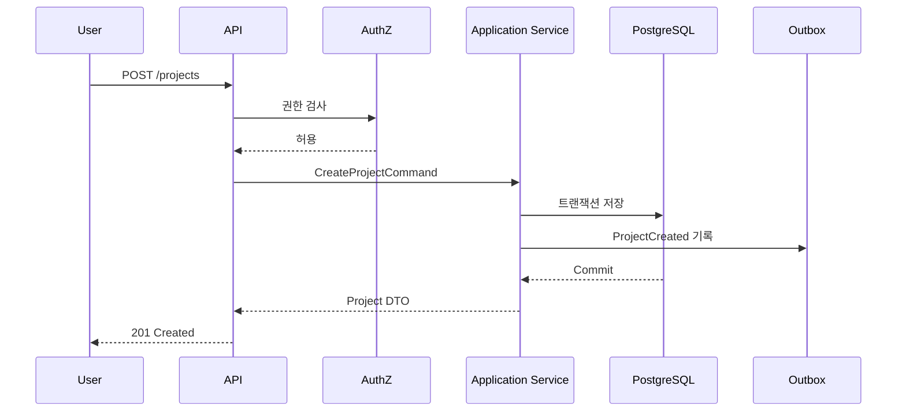
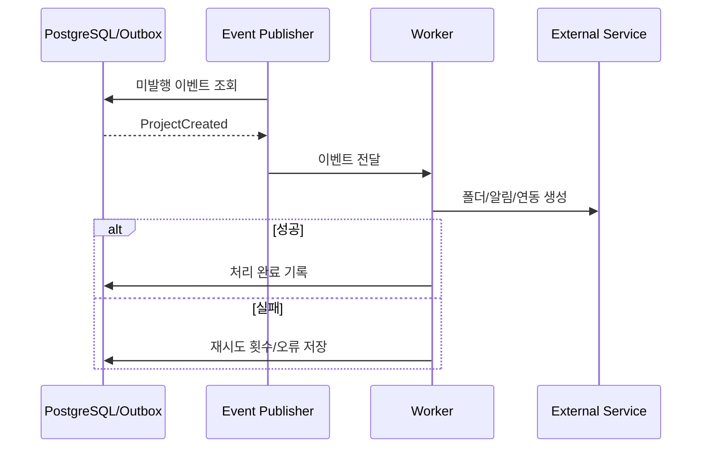

# 시스템 아키텍처 상세설계

## 1. 아키텍처 스타일

### 1.1 기본 선택: 모듈형 모놀리스 + 비동기 워커

LEP는 단일 백엔드 애플리케이션으로 배포하되, 코드·스키마·서비스 인터페이스를 도메인별로 분리한다.

장점:

- 30명 이하 조직에서 운영과 장애 분석이 단순함
- 트랜잭션 일관성을 유지하기 쉬움
- 하나의 OpenAPI와 인증 체계를 사용할 수 있음
- 에이전트별 작업 경계를 패키지 단위로 구분 가능

분리 후보:

- 문서 변환/OCR/STT 워커
- 검색 인덱싱 워커
- AI 추론·RAG 서비스
- 외부 연동 워커
- 장기 리포트 생성 워커

### 1.2 마이크로서비스 전환 조건

다음 중 두 가지 이상이 지속될 때만 분리를 검토한다.

- 독립 배포 요구가 빈번함
- 특정 모듈 부하가 전체의 70% 이상을 차지함
- 장애 격리가 실제 운영 문제로 확인됨
- 서로 다른 보안 구역이 필요함
- 별도 팀이 독립적 SLA를 책임짐

## 2. 애플리케이션 계층



## 3. 모듈 내부 표준 구조

각 도메인 모듈은 다음 구조를 따른다.

```text
modules/<domain>/
├── api/              # HTTP 요청/응답, 스키마 변환
├── application/      # 유스케이스, command/query 서비스
├── domain/           # 엔터티, 값 객체, 상태 규칙, 도메인 서비스
├── infrastructure/   # ORM, 저장소 구현, 외부 어댑터
├── events/           # 발행/구독 이벤트 정의
├── permissions/      # 권한 정책
└── tests/            # 단위·통합 테스트
```

규칙:

- API 계층은 직접 ORM을 호출하지 않는다.
- 도메인 규칙은 라우터나 UI에 중복 구현하지 않는다.
- 다른 모듈 테이블에 직접 쓰지 않는다.
- 조회 성능을 위해 읽기 전용 조인은 허용하되 소유권을 명시한다.
- 모듈 간 변경은 서비스 호출 또는 이벤트를 사용한다.

## 4. 요청 처리 흐름

### 4.1 동기 명령



### 4.2 비동기 후처리



## 5. 트랜잭션과 이벤트

### 5.1 Outbox 패턴

업무 데이터 변경과 이벤트 기록을 같은 DB 트랜잭션으로 저장한다. 별도 퍼블리셔가 outbox를 읽어 워커에 전달한다. 이를 통해 DB 변경은 성공했지만 알림·검색 인덱스가 유실되는 문제를 줄인다.

### 5.2 멱등성

- 모든 외부 웹훅과 AI 도구 실행은 idempotency key를 지원한다.
- 이벤트 소비자는 `event_id + consumer_name`으로 중복 처리를 방지한다.
- 생성 API는 선택적으로 `Idempotency-Key` 헤더를 받는다.

### 5.3 보상 처리

프로젝트 생성 후 외부 Git 저장소 생성이 실패해도 프로젝트 자체를 롤백하지 않는다. 실패한 하위 작업을 표시하고 재시도한다. 금전·재고처럼 반드시 일관된 항목은 같은 DB 트랜잭션 또는 명시적 취소 전표를 사용한다.

## 6. 인증과 세션

- 사내 계정 기반 로그인
- 비밀번호는 강한 단방향 해시로 저장
- 짧은 수명의 액세스 토큰 + 회전 가능한 리프레시 토큰 또는 서버 세션
- 관리자/재무/외부 접속은 MFA 정책 적용 가능
- 서비스 계정은 사용자 계정과 분리
- 로그인 실패 제한과 잠금 정책
- 퇴사·비활성화 시 세션 즉시 철회

## 7. 권한 판정 구조

권한은 세 층으로 판정한다.

1. **기능 권한**: 예) `project.update`, `expense.approve`
2. **범위 권한**: 전사, 부서, 프로젝트, 본인, 명시 공유
3. **속성 조건**: 상태, 금액, 역할, 민감등급

예시:

```text
사용자에게 expense.approve 권한이 있고
요청 금액이 자신의 승인 한도 이하이며
대상 부서 또는 프로젝트 범위에 속하고
본인이 신청자가 아닐 때 승인 가능
```

## 8. 파일 저장 아키텍처

### 8.1 저장 분리

- DB: 파일 메타데이터, 버전, 권한, 체크섬, 상태
- MinIO: 실제 바이너리 객체
- OpenSearch: 추출 텍스트와 검색 인덱스
- Qdrant: 권한 메타데이터가 포함된 임베딩 청크

### 8.2 업로드 흐름

1. 업로드 세션 생성
2. 서버가 사전 서명 URL 또는 프록시 업로드 제공
3. 바이러스/악성파일 검사
4. 체크섬 계산 및 중복 후보 확인
5. 메타데이터 확정
6. 비동기 텍스트 추출·미리보기·인덱싱
7. 상태를 `READY`로 전환

### 8.3 버전

- 문서 논리 ID와 파일 버전 ID를 분리
- 버전은 불변
- 최신 버전 포인터만 변경
- 승인/제출된 버전은 잠금
- 동일 파일 재업로드 시 체크섬 경고

## 9. 검색 아키텍처

### 9.1 검색 대상

고객, 연락처, 프로젝트, 업무, 회의, 문서, 계약, 자산, 지식문서, 댓글 중 공개 가능한 항목.

### 9.2 권한 필터

검색 색인에 `company_id`, `visibility`, `department_ids`, `project_ids`, `allowed_user_ids`, `classification`을 포함한다. 검색 결과를 DB 권한으로 재검증하여 색인 지연에 따른 노출을 막는다.

### 9.3 색인 일관성

- DB가 진실원천
- 이벤트 기반 증분 색인
- 주기적 재색인 검증
- 색인 실패 보관함과 관리자 재처리 화면

## 10. AI/RAG 통합 경계

- AI 서비스는 원본 DB 자격증명을 갖지 않는다.
- 검색 도구와 업무 도구는 인증된 사용자 컨텍스트를 전달받는다.
- RAG 청크는 원문 URI, 버전, 페이지/문단, 권한 메타데이터를 포함한다.
- 응답에는 근거 링크를 표시한다.
- 모델 제공자를 바꿀 수 있도록 OpenAI 호환 추상화 계층을 둔다.
- 프롬프트·도구 스키마·모델·결과·승인 이력을 버전 관리한다.

## 11. 외부 연동 구조

모든 외부 연동은 Integration Adapter로 캡슐화한다.

| 연동 | 방향 | 동기화 기준 |
|---|---|---|
| 이메일 | 수신/발신 | 메시지 ID, 스레드 ID |
| 캘린더 | 양방향 선택 | 외부 이벤트 ID, 수정 버전 |
| GitHub/GitLab | 수신 중심 | webhook delivery ID |
| 회계 시스템 | 내보내기/상태 동기화 | 전표/거래 ID |
| 전자서명 | 발송/상태 수신 | envelope ID |
| 메신저 | 알림 발송 | 채널/메시지 ID |
| 서버 모니터링 | 수신 | metric/alert fingerprint |

각 연동은 연결 상태, 마지막 동기화, 오류, 재시도, 매핑 규칙을 관리한다.

## 12. 캐시 전략

캐시는 정합성의 진실원천이 아니다.

- 사용자 세션 및 토큰 철회 목록
- 권한 판정 단기 캐시
- 대시보드 집계 캐시
- 속도 제한 카운터
- 작업 큐와 분산 잠금

쓰기 후 관련 캐시를 명시적으로 무효화하고, TTL을 짧게 유지한다.

## 13. 동시성 제어

- 대부분의 편집은 낙관적 잠금(`version` 또는 `updated_at`) 사용
- 자산 대여, 재고 차감, 결재 처리에는 DB 행 잠금 또는 원자적 조건 업데이트
- 충돌 시 덮어쓰지 않고 최신 데이터와 사용자 변경을 비교 표시

## 14. 오류 처리 표준

API 오류 형식:

```json
{
  "type": "https://erp.local/problems/validation-error",
  "title": "입력값을 확인해 주세요.",
  "status": 422,
  "code": "VALIDATION_FAILED",
  "detail": "계약 종료일은 시작일보다 이후여야 합니다.",
  "instance": "/api/v1/contracts/123",
  "trace_id": "...",
  "errors": [
    {"field": "end_date", "reason": "must_be_after_start_date"}
  ]
}
```

- 사용자에게는 해결 가능한 메시지 제공
- 내부 스택 트레이스는 노출하지 않음
- 모든 5xx 오류에 trace ID 부여
- 비동기 실패는 재시도 가능/불가능을 구분

## 15. 데이터 보존과 삭제

- 감사 로그: 장기 보존, 별도 삭제 권한
- 계약/재무/결재: 법적·회사 정책에 따른 장기 보존
- 일반 업무/댓글: 프로젝트 보존 정책에 따름
- 퇴사 사용자: 계정 비활성화, 작성 이력 유지
- 개인정보 삭제 요청: 법적 보존 대상과 분리하여 익명화/마스킹
- AI 대화: 목적·민감도별 보존 기간 설정

## 16. 확장 포인트

- 커스텀 필드: 도메인별 허용 범위와 타입 제한
- 템플릿: 프로젝트, 업무, 결재, 문서, 견적
- 웹훅: 승인된 이벤트만 외부 발송
- 플러그인형 연동 어댑터
- 보고서 정의와 저장된 쿼리
- AI 도구 레지스트리

무제한 커스터마이징은 피하고, 공통 모델을 훼손하지 않는 범위에서 확장한다.

---
