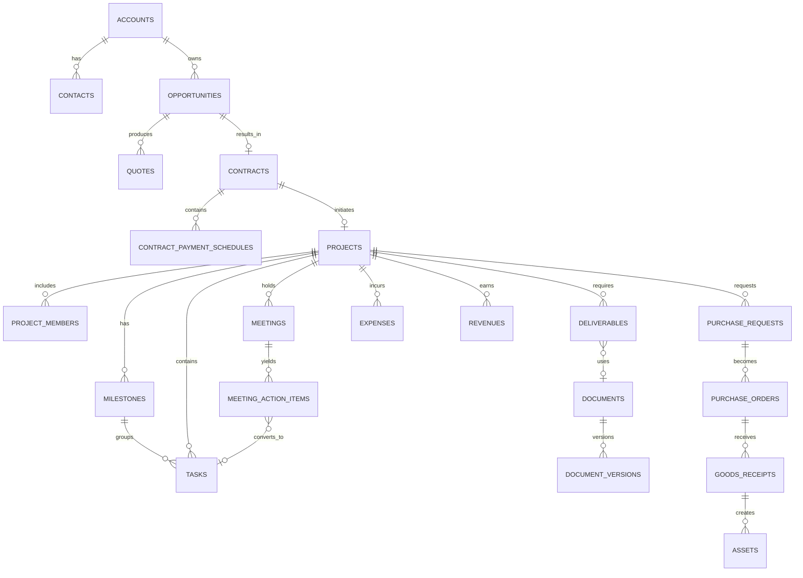

# 데이터 모델 상세설계

## 1. 모델링 원칙

1. PostgreSQL을 업무 데이터의 진실원천으로 사용한다.
2. 식별자는 외부 노출에 안전하고 분산 생성 가능한 UUID 계열을 기본으로 한다.
3. 업무용 코드(`project_code`, `contract_no`)는 별도 유일 키로 관리한다.
4. 금액은 부동소수점이 아닌 고정 정밀 숫자를 사용한다.
5. 날짜/시간은 DB에 UTC로 저장하고 사용자 시간대로 표시한다.
6. 파일 바이너리는 DB가 아니라 MinIO에 저장한다.
7. 핵심 엔터티는 물리 삭제하지 않고 보관/무효 상태를 사용한다.
8. 모든 테이블은 소유 모듈을 가진다.
9. 다른 모듈의 데이터를 복제할 때는 원본 ID와 동기화 시각을 기록한다.
10. 임의 JSONB 사용은 확장 메타데이터에 제한하며 핵심 검색/검증 필드는 정규 컬럼으로 둔다.

## 2. 공통 데이터 타입

| 타입 | 기준 |
|---|---|
| ID | UUID |
| 코드 | VARCHAR, 대소문자 규칙 고정 |
| 금액 | NUMERIC(19,4) + currency CHAR(3) |
| 비율 | NUMERIC(9,6) 또는 정수 basis point |
| 날짜 | DATE |
| 시각 | TIMESTAMPTZ |
| 기간 | start_at/end_at 또는 start_date/end_date |
| 상태 | 제한된 enum 또는 검증 테이블 |
| 이메일 | 정규화된 문자열 + 원문 표시값 선택 |
| 전화 | 국가코드 포함 정규화 문자열 |
| IP | INET |
| 구조화 확장값 | JSONB |

## 3. 공통 컬럼

대부분의 변경 가능한 엔터티:

```text
id UUID PK
company_id UUID NOT NULL
created_at TIMESTAMPTZ NOT NULL
created_by UUID NULL
updated_at TIMESTAMPTZ NOT NULL
updated_by UUID NULL
version INTEGER NOT NULL DEFAULT 1
archived_at TIMESTAMPTZ NULL
metadata JSONB NOT NULL DEFAULT '{}'
```

민감하거나 외부 입력이 있는 엔터티는 추가로 다음을 가질 수 있다.

```text
classification VARCHAR
source_type VARCHAR
external_system VARCHAR
external_id VARCHAR
```

## 4. 스키마/네임스페이스 전략

물리적으로 PostgreSQL 스키마를 나눌지 여부는 구현 시 정하되, 논리 소유권은 다음과 같이 고정한다.

```text
core, iam, collab, crm, sales, contract, project, calendar,
dms, knowledge, workflow, procurement, asset, finance, hr,
devops, infra, ai, analytics, integration
```

테이블명은 단수보다 복수형 또는 프로젝트 규칙 중 하나를 선택해 전체에 일관되게 적용한다. 아래 명세는 복수형으로 표기한다.

---

# 5. Core/IAM 테이블

## 5.1 `companies`

| 컬럼 | 설명 |
|---|---|
| id | 회사 ID |
| name | 회사명 |
| legal_name | 법인명 |
| business_number | 사업자등록번호 |
| timezone | 기본 시간대 |
| locale | 기본 언어/지역 |
| currency | 기본 통화 |
| status | ACTIVE/SUSPENDED |

현재는 단일 회사지만 `company_id`를 유지하여 데이터 경계를 명확히 한다.

## 5.2 `departments`

- id, company_id
- parent_id self FK
- code, name
- manager_employee_id
- sort_order, status
- valid_from, valid_to

## 5.3 `positions`, `job_titles`, `employment_types`

조직 기준정보. 하드코딩하지 않고 관리자가 제한적으로 편집한다.

## 5.4 `users`

- id, company_id
- login_id, email_normalized
- display_name
- password_hash
- status
- mfa_required, mfa_enrolled_at
- last_login_at
- password_changed_at
- failed_login_count, locked_until

## 5.5 `employees`

- id, company_id, user_id nullable
- employee_no unique
- name, work_email, phone
- department_id, position_id, job_title_id
- employment_type_id
- hire_date, termination_date
- status
- manager_employee_id
- profile_image_file_id

## 5.6 `external_users`

- id, user_id
- organization_name
- sponsor_employee_id
- valid_from, valid_until
- purpose

## 5.7 `roles`

- id, code, name
- scope_type: GLOBAL/DEPARTMENT/PROJECT/SELF
- system_role boolean
- description

## 5.8 `permissions`

- id, code unique
- resource, action
- risk_level
- description

## 5.9 `role_permissions`

- role_id, permission_id
- conditions JSONB (제한된 정책 DSL)

## 5.10 `user_role_assignments`

- user_id, role_id
- scope_type, scope_id nullable
- valid_from, valid_until
- granted_by, reason

유일성: 동일 사용자·역할·범위·유효기간 중복 방지.

## 5.11 `sessions`

- session_id hash
- user_id
- issued_at, expires_at, revoked_at
- ip, user_agent, last_seen_at

## 5.12 `service_accounts`, `api_tokens`

서비스 계정과 토큰을 분리한다. 토큰 원문은 저장하지 않고 해시만 저장한다.

## 5.13 `audit_logs`

- id, occurred_at
- actor_type USER/SERVICE/AI/SYSTEM
- actor_id
- action
- resource_type, resource_id
- before_json, after_json 또는 diff_json
- reason
- ip, user_agent, trace_id
- classification

감사 로그는 append-only 정책을 적용한다.

## 5.14 `activity_logs`

사용자에게 보여주는 읽기 쉬운 타임라인. 감사 로그와 목적이 다르다.

## 5.15 `outbox_events`

- event_id
- aggregate_type, aggregate_id
- event_type, schema_version
- payload JSONB
- occurred_at
- published_at
- retry_count, last_error

## 5.16 `idempotency_records`

- key, user_id, route
- request_hash
- response_status, response_body
- expires_at

---

# 6. 협업·알림 테이블

## 6.1 `comments`

- id, entity_type, entity_id
- parent_comment_id
- author_user_id
- body, body_format
- edited_at, resolved_at
- visibility

## 6.2 `comment_mentions`

- comment_id, mentioned_user_id
- notified_at, read_at

## 6.3 `attachments`

공통 첨부 링크 테이블. 실제 파일은 DMS의 file/document version을 참조한다.

- entity_type, entity_id
- document_version_id
- label, sort_order

## 6.4 `subscriptions`

- user_id, entity_type, entity_id
- notification_level

## 6.5 `notifications`

- recipient_user_id
- type, title, body
- entity_type, entity_id
- priority
- created_at, read_at, dismissed_at
- deduplication_key

## 6.6 `notification_deliveries`

- notification_id
- channel IN_APP/EMAIL/PUSH/WEBHOOK
- status
- attempted_at, delivered_at
- error_code, error_message

## 6.7 `announcements`, `announcement_targets`, `announcement_reads`

공지 본문, 대상 범위, 사용자 확인을 분리한다.

---

# 7. CRM 테이블

## 7.1 `accounts`

- id, account_code
- name, legal_name
- business_number
- account_type: PROSPECT/CUSTOMER/PARTNER/SUPPLIER/GOVERNMENT
- industry, website_domain
- owner_employee_id
- status, risk_note, classification
- primary_address_id

## 7.2 `account_addresses`

- account_id, address_type
- postal_code, address1, address2
- country_code
- is_primary

## 7.3 `contacts`

- account_id nullable
- name, department, job_title
- email, phone, mobile
- preferred_channel
- status, left_company_at
- owner_employee_id
- consent flags

## 7.4 `account_tags`, `account_tag_links`

## 7.5 `leads`

- source, subject
- person/company raw fields
- owner_employee_id
- status, score
- qualified_at, disqualified_reason
- converted_account_id, converted_contact_id, converted_opportunity_id

## 7.6 `crm_activities`

- activity_type
- account_id, contact_id, lead_id, opportunity_id nullable
- subject, summary, occurred_at
- owner_employee_id
- next_action, next_action_at
- source_message_id nullable

## 7.7 `account_relationships`

고객-파트너-원청-하청 등 회사 간 관계.

- from_account_id, to_account_id
- relationship_type
- valid_from, valid_to

---

# 8. 영업·견적 테이블

## 8.1 `opportunities`

- opportunity_no
- account_id
- name, description
- owner_employee_id
- stage_id
- expected_amount, currency
- probability
- expected_close_date
- source
- win_reason, loss_reason
- status

## 8.2 `sales_stages`

- code, name, sequence
- default_probability
- terminal_type NONE/WON/LOST

## 8.3 `opportunity_members`

- opportunity_id, employee_id, role

## 8.4 `opportunity_products`

- opportunity_id
- catalog_item_id nullable
- description
- quantity, unit_price, estimated_cost

## 8.5 `quotes`

- quote_no
- opportunity_id, account_id
- version_no
- status
- issue_date, valid_until
- currency
- subtotal, discount_total, tax_total, grand_total
- payment_terms, delivery_terms
- owner_employee_id
- approved_document_version_id
- supersedes_quote_id nullable

유일성: `(quote_no, version_no)`.

## 8.6 `quote_items`

- quote_id, line_no
- item_type PRODUCT/SERVICE/EXPENSE/OTHER
- catalog_item_id nullable
- name, description
- quantity, unit
- unit_price, discount_type, discount_value
- tax_type, tax_rate
- cost_amount (권한 제한)
- line_subtotal, line_tax, line_total

## 8.7 `quote_approvals`, `quote_deliveries`

결재 인스턴스 링크와 발송 기록.

## 8.8 `catalog_items`

서비스·제품 표준 품목.

- code, name, category
- default_unit, list_price, default_cost
- tax_type, active

---

# 9. 계약 테이블

## 9.1 `contracts`

- contract_no
- contract_type
- title
- customer_account_id
- supplier_account_id nullable
- opportunity_id nullable
- project_id nullable
- status
- start_date, end_date
- currency
- contract_amount
- payment_terms
- owner_employee_id
- security_classification
- signed_document_version_id
- parent_contract_id nullable
- renewal_type, auto_renew boolean
- notice_days

## 9.2 `contract_versions`

- contract_id, version_no
- effective_date
- summary_of_changes
- document_version_id
- amount, start_date, end_date snapshot
- approved_at, signed_at

## 9.3 `contract_parties`

- contract_id
- party_type CUSTOMER/SUPPLIER/PARTNER/OUR_COMPANY
- account_id nullable
- legal_name snapshot
- signer_contact_id nullable
- role

## 9.4 `contract_obligations`

- contract_id
- obligation_type
- title, description
- owner_employee_id
- due_date
- status
- evidence_document_id
- project_id nullable

## 9.5 `contract_payment_schedules`

- contract_id
- sequence
- schedule_type
- milestone_id nullable
- planned_date
- amount, tax_type
- status
- revenue_record_id nullable

## 9.6 `contract_renewal_alerts`

갱신 알림 생성 이력과 처리 상태.

---

# 10. 프로젝트·업무 테이블

## 10.1 `projects`

- project_code unique
- name
- project_type_id
- customer_account_id nullable
- contract_id nullable
- opportunity_id nullable
- pm_employee_id
- sponsor_employee_id nullable
- status, priority
- planned_start_date, planned_end_date
- actual_start_date, actual_end_date
- description, scope, success_criteria
- health_manual, health_auto, health_reason
- template_id nullable
- security_classification

## 10.2 `project_types`

AI 개발, SI, 연구개발, 유지보수, 내부 프로젝트 등.

## 10.3 `project_members`

- project_id, user_id 또는 employee_id
- project_role_id
- allocation_percent nullable
- joined_at, left_at
- access_level

## 10.4 `project_roles`

PM, 팀원, 검토자, 고객협업자 등.

## 10.5 `project_templates`

- name, project_type_id
- version
- active
- template_definition JSONB

템플릿 정의는 버전 불변으로 유지한다.

## 10.6 `milestones`

- project_id
- code, name, description
- status
- planned_start_date, due_date
- actual_completed_at
- owner_employee_id
- progress_percent
- sequence

## 10.7 `tasks`

- project_id nullable
- milestone_id nullable
- parent_task_id nullable
- task_no 또는 project-local sequence
- title, description
- task_type
- status, priority
- assignee_employee_id nullable
- reporter_employee_id
- reviewer_employee_id nullable
- start_at, due_at, completed_at
- estimated_minutes, actual_minutes
- progress_percent
- source_type, source_id
- blocked_reason
- version

## 10.8 `task_assignees`

공동 담당이 필요한 경우 사용. `tasks.assignee_employee_id`를 주 담당으로 유지할 수 있다.

## 10.9 `task_dependencies`

- predecessor_task_id
- successor_task_id
- dependency_type FINISH_TO_START 등
- lag_minutes

순환 의존성을 금지한다.

## 10.10 `task_checklist_items`

- task_id, content, sequence
- required, completed_at, completed_by

## 10.11 `task_time_entries`

- task_id, employee_id
- work_date
- minutes
- description
- billable boolean
- approval_status

초기에는 선택 기능으로 활성화할 수 있다.

## 10.12 `issues`

- project_id
- issue_no
- title, description
- severity, status
- owner_employee_id
- occurred_at, resolved_at
- root_cause, resolution

## 10.13 `risks`

- project_id
- risk_no
- title, description
- probability, impact
- score
- strategy AVOID/MITIGATE/TRANSFER/ACCEPT
- owner_employee_id
- review_date, status
- mitigation_plan

## 10.14 `decisions`

- project_id nullable
- meeting_id nullable
- decision_no
- title, context, decision, rationale, consequences
- decided_at, decided_by
- status, superseded_by_id

## 10.15 `project_health_snapshots`

날짜별 건강도 계산 결과와 구성 지표를 보존한다.

---

# 11. 일정·회의 테이블

## 11.1 `calendars`

개인, 부서, 프로젝트, 회사 캘린더.

## 11.2 `calendar_events`

- calendar_id
- event_type
- title, description
- starts_at, ends_at
- all_day
- timezone
- location, meeting_url
- recurrence_rule nullable
- project_id, task_id, meeting_id nullable
- visibility
- external_system, external_id, sync_version

## 11.3 `event_attendees`

- event_id
- user_id/contact_id/email
- attendee_type
- response_status

## 11.4 `meetings`

- meeting_no
- project_id nullable
- calendar_event_id
- purpose, agenda
- organizer_employee_id
- status
- recording_document_version_id nullable
- transcript_document_version_id nullable
- minutes_document_id nullable

## 11.5 `meeting_attendees`

- meeting_id
- user_id/contact_id
- role, attendance_status

## 11.6 `meeting_agenda_items`

- meeting_id, sequence
- title, description
- owner_employee_id
- related_entity_type/id

## 11.7 `meeting_decisions`

`decisions` 엔터티 링크 또는 회의 전용 조인.

## 11.8 `meeting_action_items`

- meeting_id
- text
- suggested_assignee_id, confirmed_assignee_id
- suggested_due_date, confirmed_due_date
- source_reference
- status DRAFT/CONFIRMED/CONVERTED/REJECTED
- converted_task_id

---

# 12. DMS/지식 테이블

## 12.1 `file_objects`

- storage_provider
- bucket, object_key
- size_bytes
- mime_type
- checksum_algorithm, checksum
- encryption_key_ref nullable
- scan_status
- created_at

파일 객체는 불변이다.

## 12.2 `documents`

- document_no nullable
- title
- document_type_id
- project_id nullable
- owner_employee_id
- folder_id nullable
- status
- security_classification
- current_version_id nullable
- approved_version_id nullable
- retention_policy_id nullable

## 12.3 `document_versions`

- document_id
- version_no
- file_object_id
- original_filename
- change_summary
- created_by
- created_at
- text_extraction_status
- preview_status
- locked boolean
- checksum snapshot

유일성: `(document_id, version_no)`.

## 12.4 `folders`

- parent_folder_id
- name
- project_id nullable
- path_cache
- security_classification
- inherited_permissions boolean

동일 부모 아래 이름 중복 정책을 정한다.

## 12.5 `document_types`

계약서, 견적서, 회의록, 보고서, 설계서, 소스전달, 증빙 등.

## 12.6 `document_tags`, `document_tag_links`

## 12.7 `document_permissions`

명시 공유가 필요할 때만 사용. 기본은 역할/프로젝트 권한 상속.

## 12.8 `document_reviews`

- document_id, document_version_id
- review_type
- reviewer_user_id
- status
- requested_at, completed_at
- comments

## 12.9 `deliverables`

- project_id
- deliverable_code
- name, description
- document_type_id
- milestone_id nullable
- owner_employee_id
- reviewer_employee_id
- approver_employee_id
- required boolean
- due_date
- status
- current_document_id nullable
- approved_version_id nullable
- waiver_approval_instance_id nullable

## 12.10 `deliverable_submissions`

- deliverable_id
- document_version_id
- submitted_at, submitted_by
- recipient_account_id/contact_id
- channel
- external_reference
- status
- feedback

## 12.11 `knowledge_articles`

- article_no
- title, slug
- category_id
- owner_employee_id
- status
- security_classification
- current_version_id
- valid_from, valid_until
- review_due_date
- replaces_article_id nullable
- include_in_rag boolean

## 12.12 `knowledge_article_versions`

- article_id, version_no
- content
- change_summary
- created_by, created_at

## 12.13 `retention_policies`

- code, name
- retention_days 또는 permanent
- disposition_action ARCHIVE/DELETE/REVIEW
- legal_hold_supported

---

# 13. 결재·워크플로우 테이블

## 13.1 `approval_templates`

- code, name
- form_type
- version
- active
- form_schema JSONB
- routing_rules JSONB
- sla_rules JSONB

승인된 템플릿 버전은 불변으로 취급한다.

## 13.2 `approval_instances`

- approval_no
- template_id, template_version
- title
- requester_user_id
- entity_type, entity_id nullable
- form_data JSONB
- snapshot_hash
- status
- submitted_at, completed_at
- current_step_no

## 13.3 `approval_steps`

- instance_id
- sequence
- step_type APPROVE/AGREE/REVIEW/REFERENCE/EXECUTE
- execution_mode SEQUENTIAL/PARALLEL
- status
- due_at

## 13.4 `approval_assignees`

- step_id
- assignee_user_id 또는 role_expression
- delegated_from_user_id nullable
- status
- acted_at
- decision
- comment
- signature_metadata

## 13.5 `approval_history`

상태 전이와 모든 행위를 append-only로 기록.

## 13.6 `delegations`

- from_user_id, to_user_id
- scope
- valid_from, valid_until
- reason

## 13.7 `workflow_jobs`

승인 후 실행, 알림, 연동 등 비동기 실행 단위.

---

# 14. 구매 테이블

## 14.1 `suppliers`

CRM의 `accounts`를 참조하거나 공급사 전용 확장 테이블로 둔다.

- account_id PK/FK
- payment_terms
- bank_info_encrypted 또는 외부 보관
- evaluation_status

## 14.2 `purchase_requests`

- pr_no
- requester_employee_id
- project_id nullable
- budget_id nullable
- purpose
- desired_delivery_date
- estimated_total
- status
- approval_instance_id

## 14.3 `purchase_request_items`

- purchase_request_id
- line_no
- item_name, specification
- quantity, unit
- estimated_unit_price
- suggested_supplier_id
- asset_candidate boolean

## 14.4 `supplier_quotes`

- purchase_request_id
- supplier_id
- quote_document_version_id
- total_amount
- valid_until
- selected boolean
- evaluation_note

## 14.5 `purchase_orders`

- po_no
- supplier_id
- purchase_request_id nullable
- project_id nullable
- order_date, expected_delivery_date
- subtotal, tax_total, grand_total
- status
- approved_amount
- sent_at

## 14.6 `purchase_order_items`

- purchase_order_id
- source_pr_item_id nullable
- description, quantity, unit
- unit_price, tax
- received_quantity

## 14.7 `goods_receipts`

- receipt_no
- purchase_order_id
- received_at
- receiver_employee_id
- status
- inspection_result

## 14.8 `goods_receipt_items`

- receipt_id, po_item_id
- quantity_received
- quantity_accepted
- quantity_rejected
- note

## 14.9 `purchase_returns`

반품 수량과 사유, 공급사 처리 상태.

---

# 15. 자산·재고 테이블

## 15.1 `asset_categories`

계층형 분류, 감가/점검 기본정책은 참고값.

## 15.2 `assets`

- asset_no
- category_id
- name, manufacturer, model, serial_number
- purchase_order_item_id nullable
- purchase_date, purchase_amount
- status
- current_holder_employee_id nullable
- current_location_id nullable
- project_id nullable
- warranty_end_date
- next_inspection_date
- security_classification
- parent_asset_id nullable

## 15.3 `asset_events`

- asset_id
- event_type ASSIGN/RETURN/MOVE/REPAIR/INSPECT/CONFIGURE/RETIRE/DISPOSE/LOST
- occurred_at
- actor_employee_id
- from_holder/to_holder
- from_location/to_location
- details
- approval_instance_id nullable

## 15.4 `asset_maintenance_records`

- asset_id
- maintenance_type
- vendor_id
- started_at, completed_at
- cost
- result, next_due_date

## 15.5 `locations`

회사, 사무실, 창고, 현장, 랙 등 계층형 위치.

## 15.6 `inventory_items`

- sku
- category_id
- name, unit
- minimum_quantity
- active

## 15.7 `inventory_balances`

- inventory_item_id, location_id
- quantity_on_hand
- quantity_reserved
- version

## 15.8 `inventory_transactions`

- transaction_no
- inventory_item_id, location_id
- type RECEIVE/ISSUE/TRANSFER/ADJUST/RETURN
- quantity
- project_id, employee_id nullable
- reference_type/id
- reason
- occurred_at

재고 잔액은 원장 합계와 정기 검증한다.

---

# 16. 재무 테이블

## 16.1 `budgets`

- budget_no
- scope_type COMPANY/DEPARTMENT/PROJECT
- scope_id
- fiscal_year
- status
- currency
- total_amount
- approved_at

## 16.2 `budget_lines`

- budget_id
- cost_category_id
- planned_amount
- committed_amount 캐시
- actual_amount 캐시
- alert_threshold_percent

캐시 금액은 원장과 재계산 가능해야 한다.

## 16.3 `cost_categories`

장비, 외주, 출장, 소프트웨어, 소모품, 통신 등.

## 16.4 `expenses`

- expense_no
- employee_id
- project_id nullable
- department_id
- expense_date
- merchant_account_id nullable
- description
- payment_method
- currency
- net_amount, tax_amount, total_amount
- cost_category_id
- status
- approval_instance_id
- receipt_document_version_id nullable
- external_accounting_id nullable

## 16.5 `expense_items`

복합 영수증/분할 배부를 위한 항목.

## 16.6 `expense_allocations`

- expense_item_id
- allocation_type PROJECT/DEPARTMENT
- project_id/department_id
- budget_line_id nullable
- amount

배부 합계는 원 항목 금액과 일치해야 한다.

## 16.7 `revenues`

- revenue_no
- contract_id, project_id
- payment_schedule_id nullable
- planned_date, invoice_date, due_date
- net_amount, tax_amount, total_amount
- status PLANNED/INVOICED/PARTIALLY_COLLECTED/COLLECTED/OVERDUE/CANCELLED
- external_invoice_id

## 16.8 `revenue_collections`

- revenue_id
- collected_at
- amount
- method
- reference

## 16.9 `payables`

- supplier_id
- purchase_order_id nullable
- expense_id nullable
- invoice_date, due_date
- amounts
- status
- external_accounting_id

## 16.10 `payment_records`

실제 지급 결과만 기록하며 은행 이체 실행 기능은 비범위.

## 16.11 `financial_exports`

외부 회계 시스템으로 내보낸 배치, 파일, 상태, 오류.

## 16.12 `project_financial_snapshots`

기준일별 계약·예산·예정·확정 비용과 손익 스냅샷.

---

# 17. HR 테이블

## 17.1 `employee_private_profiles`

민감 인사정보를 일반 직원 테이블과 분리하고 암호화/접근 감사를 강화한다.

## 17.2 `work_schedules`

- employee_id 또는 department_id
- valid_from/to
- expected_start/end, workdays

## 17.3 `attendance_records`

- employee_id, work_date
- check_in_at, check_out_at
- work_type
- source
- status
- total_minutes 캐시

## 17.4 `attendance_corrections`

- attendance_record_id
- requested values
- reason
- approval_instance_id
- status

## 17.5 `leave_types`

- code, name
- unit DAY/HALF_DAY/HOUR
- paid boolean
- approval_required
- carryover rules

## 17.6 `leave_balances`

- employee_id, leave_type_id, year
- granted, used, scheduled, expired
- version

## 17.7 `leave_requests`

- employee_id, leave_type_id
- start_at, end_at
- quantity
- reason (민감도 고려)
- status
- approval_instance_id

## 17.8 `skills`, `employee_skills`

기술명, 숙련도, 검증일, 증빙.

## 17.9 `certifications`, `employee_certifications`

발급일·만료일·증빙 문서.

## 17.10 `training_courses`, `training_records`

## 17.11 `performance_cycles`, `performance_reviews`

평가 데이터는 별도 권한과 보존 정책 적용.

---

# 18. DevOps/인프라 테이블

## 18.1 `code_repositories`

- provider, external_id
- name, url
- project_id
- default_branch
- visibility
- sync_status

## 18.2 `code_issues`, `pull_requests`, `commits`, `releases`

외부 메타데이터 캐시. 원본 링크와 마지막 동기화 시각 필수.

## 18.3 `task_code_links`

- task_id
- provider_entity_type
- provider_entity_id
- relation_type IMPLEMENTS/REFERENCES/FIXES

## 18.4 `deployment_environments`

- project_id
- name DEV/STAGE/PROD
- url
- owner_employee_id
- classification

## 18.5 `deployments`

- environment_id
- release_id/commit_sha
- status
- started_at, completed_at
- triggered_by
- external_run_id

## 18.6 `infrastructure_nodes`

- asset_id nullable
- name, node_type
- management_ip encrypted/restricted
- environment
- owner_employee_id
- status

## 18.7 `monitored_services`

- node_id nullable
- service_name, service_type
- project_id nullable
- health_endpoint
- owner_employee_id

## 18.8 `incidents`

- incident_no
- severity
- title, description
- service_id
- status
- detected_at, acknowledged_at, resolved_at
- commander_employee_id
- root_cause, resolution

## 18.9 `alert_events`

외부 모니터링 경보의 fingerprint와 상태 변화를 저장한다.

---

# 19. AI/RAG 테이블

## 19.1 `ai_conversations`

- conversation_id
- owner_user_id
- project_id nullable
- title
- security_classification
- status
- model_policy_id
- retention_policy_id

## 19.2 `ai_messages`

- conversation_id
- role USER/ASSISTANT/TOOL/SYSTEM
- content 또는 암호화 참조
- model_name, prompt_version
- token_usage, latency_ms
- created_at
- parent_message_id nullable

## 19.3 `ai_runs`

하나의 에이전트 실행 추적.

- run_id
- conversation_id
- orchestrator_version
- status
- requested_by
- started_at, completed_at
- plan_summary
- risk_level
- total_cost_estimate
- trace_id

## 19.4 `ai_run_steps`

- run_id, sequence
- agent_type
- tool_name nullable
- input_redacted
- output_redacted
- status
- started_at, completed_at
- error

## 19.5 `ai_tool_definitions`

- name, version
- description
- input_schema
- required_permissions
- risk_level
- approval_policy
- active

## 19.6 `ai_tool_invocations`

- run_step_id
- tool_name/version
- idempotency_key
- acting_user_id
- target_entity
- requested_payload
- approved_payload
- result
- status

## 19.7 `ai_approval_requests`

- run_id/tool_invocation_id
- approver_user_id 또는 role
- risk_summary
- preview
- status
- expires_at
- decision_comment

## 19.8 `rag_sources`

- source_type DOCUMENT/WIKI/MEETING/COMMENT/CODE
- source_id, source_version
- title
- classification
- owner_module
- indexed_at
- checksum
- status

## 19.9 `rag_chunks`

실제 벡터는 Qdrant에 저장하되 DB에는 추적 메타데이터를 보존한다.

- source_id
- chunk_no
- qdrant_point_id
- text_hash
- locator(page, paragraph, timestamp)
- permission_fingerprint
- embedding_model

## 19.10 `ai_evaluations`

- run_id/message_id
- evaluation_type
- evaluator USER/AUTOMATED/REVIEWER
- score
- feedback
- created_at

## 19.11 `ai_prompt_versions`, `ai_model_policies`

프롬프트와 모델 라우팅 정책을 버전 관리한다.

---

# 20. Integration 테이블

## 20.1 `integration_connections`

- provider
- name
- status
- credential_reference
- configuration_encrypted
- owner_employee_id
- last_success_at, last_error_at

## 20.2 `external_object_mappings`

- connection_id
- local_entity_type/id
- external_entity_type/id
- sync_version
- last_synced_at

## 20.3 `webhook_deliveries`

- provider
- delivery_id unique
- received_at
- signature_valid
- event_type
- payload_hash
- processing_status
- error

## 20.4 `integration_jobs`

- connection_id
- job_type
- entity reference
- status
- attempt_count
- next_retry_at
- last_error

## 20.5 `dead_letter_items`

재시도 한도를 넘은 이벤트/연동 작업과 관리자 처리 이력.

---

# 21. Analytics 테이블

원본 업무 테이블에 직접 무거운 집계를 반복하지 않도록 스냅샷/머티리얼라이즈드 뷰를 사용한다.

- `daily_project_metrics`
- `daily_sales_metrics`
- `daily_finance_metrics`
- `daily_workload_metrics`
- `daily_ai_usage_metrics`
- `report_definitions`
- `report_runs`
- `dashboard_layouts`
- `saved_views`

집계 테이블은 재생성 가능해야 하며 진실원천으로 사용하지 않는다.

---

# 22. 핵심 관계 ERD



# 23. 인덱스 기준

필수 인덱스 후보:

- 모든 FK
- `(company_id, status)`
- 코드/번호 유일 인덱스
- 날짜 범위 조회: due_date, starts_at, end_date
- 담당자별 업무: `(assignee_employee_id, status, due_at)`
- 프로젝트별 타임라인: `(project_id, created_at desc)`
- 감사: `(resource_type, resource_id, occurred_at desc)`
- 외부 ID: `(connection_id, external_entity_type, external_id)` unique
- 미처리 outbox: 부분 인덱스 `published_at IS NULL`
- 알림: `(recipient_user_id, read_at, created_at desc)`

JSONB GIN 인덱스는 실제 쿼리가 확인된 필드에만 적용한다.

# 24. 제약조건 기준

- 종료일 >= 시작일
- 금액 >= 0, 단 취소/조정 전표는 별도 유형
- 진행률 0~100
- 확률 0~1 또는 0~100 중 하나로 통일
- 휴가 사용량 > 0
- 재고 차감 후 음수 금지
- 배부 합계 = 원 금액
- 승인 단계 순서와 담당자 유효성
- 프로젝트 코드, 계약번호, 견적번호 중복 금지
- 문서 버전은 증가만 가능
- 순환 업무 의존성 금지

중요 규칙은 DB 제약과 애플리케이션 검증을 함께 사용한다.

# 25. 개인정보·암호화 분류

| 등급 | 예시 | 저장/접근 기준 |
|---|---|---|
| PUBLIC | 공개 회사 소개 | 일반 접근 |
| INTERNAL | 프로젝트 일반자료 | 인증 사용자/프로젝트 권한 |
| CONFIDENTIAL | 계약금액, 고객 비공개 자료 | 제한 역할, 다운로드 감사 |
| RESTRICTED | 인사 민감정보, 계좌, 비밀 설정 | 필드 암호화, MFA, 상세 감사 |

비밀키·비밀번호 원문은 업무 DB에 저장하지 않는다.

# 26. 데이터 이관 원칙

1. 원본별 소유자와 최신성 기준을 정한다.
2. 고객·프로젝트·직원·문서의 중복 정제 규칙을 먼저 적용한다.
3. 파일은 체크섬을 계산하고 원본 경로를 보존한다.
4. 이관 전후 건수·금액·관계 무결성을 비교한다.
5. 이관 배치 ID를 모든 레코드에 추적 가능하게 남긴다.
6. 실패 항목은 재실행 가능한 오류 파일로 제공한다.
7. 운영 전환 직전에 증분 이관 또는 동결 시간을 정한다.

# 27. 예상 규모와 용량

30명 조직 기준으로 트랜잭션 DB는 비교적 작지만 문서와 AI 인덱스가 빠르게 증가한다.

초기 용량 계획의 기준 예:

- PostgreSQL 업무 DB: 수십~수백 GB 여유 확보
- MinIO 문서: 수 TB 단위 확장 가능
- 검색/벡터 인덱스: 원문 크기, 청크 수, 임베딩 차원에 따라 별도 산정
- 감사/로그: 보존 기간과 압축 정책 필요

정확한 용량은 기존 파일 서버와 예상 연간 생성량을 조사해 확정한다.

---
