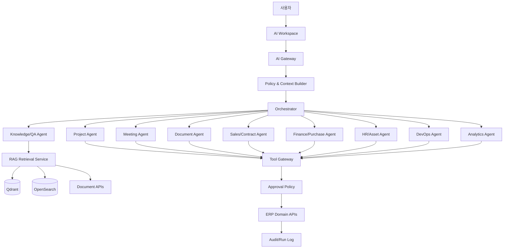
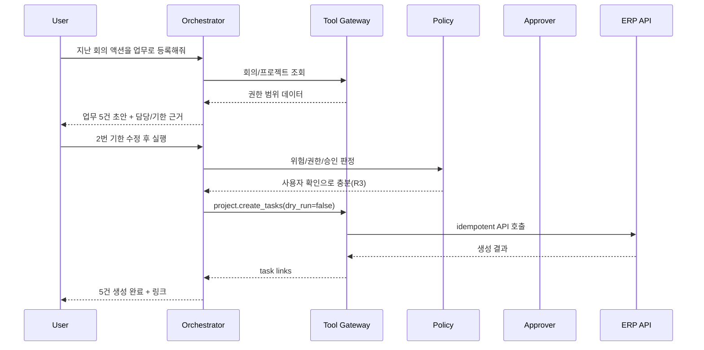
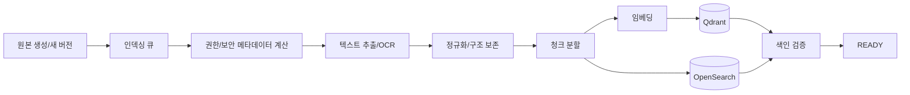

# AI 에이전트 및 RAG 상세설계

## 1. 목표

LEP의 AI는 단순 질의응답 챗봇이 아니라 다음 역할을 수행하는 **통제 가능한 업무 보조 계층**이다.

- 사내 문서와 업무 데이터를 권한 범위 안에서 검색
- 회의·문서·프로젝트 상태를 요약
- 업무·일정·결재·보고서 초안을 생성
- 누락, 지연, 갱신, 위험 신호를 점검
- 사용자가 승인한 업무 API를 호출
- 실행 결과와 근거를 추적 가능하게 기록

AI의 목표는 사용자를 대체하는 것이 아니라 입력·검색·정리·검증 비용을 줄이는 것이다.

## 2. 설계 원칙

1. **권한 상속**: AI는 요청 사용자의 권한보다 넓은 데이터에 접근할 수 없다.
2. **도구 제한**: 범용 DB/셸 접근 대신 허용된 업무 도구만 사용한다.
3. **계획과 실행 분리**: 먼저 계획·미리보기를 제시하고 필요한 경우 승인 후 실행한다.
4. **근거 우선**: 사내 사실을 답할 때 원본 링크와 위치를 제공한다.
5. **불확실성 표시**: 추정과 사실을 구분한다.
6. **중요 행위 인간 승인**: 금전, 계약, 인사, 권한, 외부 발송, 대량 변경은 승인 필수.
7. **재현 가능성**: 모델, 프롬프트, 도구 버전과 실행 입력을 기록한다.
8. **실패 격리**: AI 장애가 ERP 기본 업무를 막지 않는다.

## 3. 전체 구조

## 4. 컴포넌트

### 4.1 AI Gateway

- 사용자 인증 컨텍스트 수신
- 요청 크기/빈도 제한
- 민감정보 탐지 및 마스킹 정책
- 모델 라우팅
- 대화·실행 trace 생성
- 스트리밍 응답

### 4.2 Context Builder

요청에 필요한 최소 컨텍스트만 구성한다.

- 현재 사용자/역할/부서
- 현재 프로젝트/화면/엔터티
- 사용자가 선택한 기간
- 권한 범위
- 회사 용어집·정책
- 이전 대화의 허용된 요약

UI에 보이지 않는 전사 데이터를 무차별로 프롬프트에 넣지 않는다.

### 4.3 Orchestrator

- 사용자 의도 분류
- 단순 질의인지 다단계 실행인지 판단
- 필요한 전문 에이전트 선택
- 단계별 계획 생성
- 도구 호출 순서와 의존성 관리
- 위험 수준 계산
- 승인 중단/재개
- 실패 시 재시도 또는 사용자에게 명확한 부분 결과 제공

초기에는 하나의 오케스트레이터가 전문 프롬프트와 도구 세트를 선택하는 구조를 권장한다. 독립 프로세스의 다중 에이전트는 실제 필요가 확인될 때 확장한다.

### 4.4 Tool Gateway

- 도구 레지스트리
- JSON Schema 검증
- 권한 판정
- dry-run
- 승인 정책
- idempotency
- 실행 결과 표준화
- 감사 로그

### 4.5 RAG Service

- 하이브리드 검색(키워드 + 벡터)
- 메타데이터/권한 필터
- 최신 버전 우선
- 문서 유형과 신뢰도 가중치
- 재랭킹
- 인용 위치 생성
- 답변 후 원문 권한 재검증

### 4.6 Model Gateway

모델 제공자를 추상화한다.

- 로컬 모델
- 사내 GPU 추론 서버
- 승인된 외부 API
- 임베딩 모델
- OCR/STT 모델

요청 민감도, 비용, 길이, 도구 사용 능력에 따라 모델을 선택한다.

---

# 5. 에이전트 목록과 책임

## 5.1 Knowledge Agent

책임:

- 사내 정책·문서·회의·프로젝트 검색
- 질문 분해와 검색어 생성
- 근거의 최신성·권한·충돌 확인
- 출처 포함 답변

허용 도구:

- `search.hybrid`
- `document.get_excerpt`
- `project.get_summary`
- `knowledge.get_article`

쓰기 도구 없음.

## 5.2 Project Agent

책임:

- 프로젝트 상태 요약
- 지연/차단/리스크 분석
- 프로젝트·마일스톤·업무 초안
- 산출물 체크리스트 점검
- 주간보고 초안

도구 예:

- `project.get`
- `project.list_tasks`
- `project.create_task`
- `project.update_task`
- `project.create_risk`
- `project.generate_status_snapshot`

중요 변경은 승인 필요.

## 5.3 Meeting Agent

책임:

- 녹음/전사/메모 요약
- 안건·결정·액션아이템 추출
- 미완료 이전 액션 점검
- 후속 업무·회의 초안

규칙:

- 담당자와 기한은 근거를 표시
- 명시되지 않은 값은 추천으로 구분
- 참가자 검토 전 공식 회의록 상태로 전환하지 않음

## 5.4 Document Agent

책임:

- 문서 분류·메타데이터 제안
- 버전 비교 요약
- 문서 초안/목차/양식 채우기
- 산출물 누락·승인·버전 점검
- 외부 제출 패키지 후보 구성

외부 공유·발송은 항상 승인 필요.

## 5.5 Sales/Contract Agent

책임:

- 고객/영업 활동 요약
- 후속 행동 제안
- 견적 설명·조건 초안
- 계약 핵심조건/의무/갱신일 추출
- 수주 후 프로젝트 전환 준비

금액·계약 상태 변경, 외부 발송은 승인 필수. 법률 자문처럼 단정하지 않고 검토 필요성을 표시한다.

## 5.6 Finance/Purchase Agent

책임:

- 증빙 정보 추출
- 비용 항목·프로젝트·예산 후보 추천
- 중복 증빙 후보 탐지
- 구매 비교표 초안
- 프로젝트 비용·손익 설명

지출 승인, 예산 변경, 지급 처리, 공급사 계좌 변경은 직접 수행하지 않는다.

## 5.7 HR/Asset Agent

책임:

- 휴가/근태/자산 현황 검색
- 자산 배정·반납 초안
- 자격/점검/보증 만료 알림
- 인력 가용성 요약

개별 평가·민감 인사정보는 높은 보안 정책과 전용 모델/로그 정책을 적용한다.

## 5.8 Development Agent

책임:

- 프로젝트 업무와 Git 이슈/PR 연결
- 개발 활동 요약
- 릴리스 노트 초안
- 실패 빌드/배포 설명

코드 작성·실행 에이전트와 ERP 운영 에이전트는 분리한다. ERP 에이전트가 사내 서버에서 임의 코드를 실행하지 않는다.

## 5.9 Infrastructure Agent

책임:

- 서버·GPU·서비스 상태 요약
- 경보 중복 묶기
- 장애 대응 체크리스트 제안
- 과거 유사 장애 검색
- 포스트모템 초안

서비스 재시작, 배포, 방화벽/계정 변경은 별도 운영 승인 도구를 통해서만 수행한다.

## 5.10 Analytics/Report Agent

책임:

- KPI 조회 및 설명
- 주간/월간/프로젝트 보고서 초안
- 이상 변화 탐지
- 수치 근거 링크 제공

AI가 직접 임의 SQL을 생성·실행하지 않고 승인된 집계 API/semantic metric을 사용한다.

## 5.11 Admin Agent

초기에는 읽기 전용 지원으로 제한한다.

- 설정 설명
- 권한 시뮬레이션
- 연동 오류 진단
- 작업 큐 실패 요약

사용자/역할/보안 정책 변경은 높은 위험 승인과 관리자 MFA가 필요하다.

---

# 6. 위험 등급과 승인 정책

| 등급 | 예시 | 정책 |
|---|---|---|
| R0 Read-only | 검색, 조회, 요약 | 사용자 권한 내 자동 수행 |
| R1 Draft | 보고서·업무·메일 초안 | 자동 생성, 저장 전 확인 가능 |
| R2 Low-impact write | 본인 메모, 개인 저장 보기 | 정책상 자동 또는 간단 확인 |
| R3 Business write | 업무 생성/수정, 회의 확정 | 미리보기 후 사용자 확인 |
| R4 Sensitive | 금액, 계약, 인사, 권한, 외부 발송 | 지정 승인자 결재 필수 |
| R5 Prohibited | 비밀키 조회, 감사 삭제, 은행 이체 | 도구 자체를 제공하지 않음 |

추가 조건:

- 10건 이상 bulk write는 최소 R4
- 외부 시스템 쓰기는 최소 R4
- 영구 삭제는 원칙적으로 R5 또는 별도 관리 절차
- 사용자가 본인 업무를 수정해도 AI가 실행하면 미리보기 제공

# 7. 계획-승인-실행 프로토콜

R4의 경우 `A` 승인 단계에서 실행이 중단되며, 승인 시 고정된 payload로 재개한다.

# 8. 도구 설계 규칙

좋은 도구는 좁고 명확하다.

좋은 예:

- `project.create_task`
- `meeting.confirm_action_items`
- `document.request_review`
- `expense.create_draft`

나쁜 예:

- `database.execute_sql`
- `erp.call_any_api`
- `filesystem.write_anywhere`
- `admin.do_action`

모든 도구 정의에 포함할 항목:

- 이름/버전/설명
- 입력/출력 JSON Schema
- 필요한 권한
- 위험 등급
- 승인 정책
- dry-run 지원 여부
- idempotency 정책
- 최대 건수/금액
- 감사 필드
- 실패 코드

# 9. RAG 수집 파이프라인

## 9.1 지원 소스

- PDF, DOCX, PPTX, XLSX, HTML, Markdown, TXT
- 회의 전사 텍스트
- 위키/FAQ
- 프로젝트·업무·결정·리스크 요약
- 선택된 Git 문서/코드

ZIP은 먼저 안전하게 목록화하고 허용된 파일만 추출한다. 실행파일과 비밀파일은 인덱싱하지 않는다.

## 9.2 청크 메타데이터

- company_id
- source_type/source_id/source_version
- project_id/department_id
- document_type
- classification
- allowed principal fingerprint
- title
- page/slide/sheet/paragraph/timestamp
- valid_from/valid_until
- created_at/updated_at
- checksum
- embedding_model/version

## 9.3 청크 전략

- 문서 구조(제목, 표, 페이지)를 유지
- 표는 행/열 의미를 잃지 않도록 별도 표현
- 너무 작은 청크와 과도한 중첩을 피함
- 버전이 바뀌면 이전 벡터 비활성화 후 새 버전 색인
- OCR 신뢰도가 낮은 구간 표시

# 10. 검색 및 답변 생성

1. 사용자 질의를 의도·엔터티·기간으로 분석
2. 권한 범위 필터 구성
3. 키워드 검색과 벡터 검색 병렬 수행
4. 최신성·문서 유형·프로젝트 일치도로 재랭킹
5. 중복/구버전 제거
6. 필요한 경우 원문 상세 구간 재조회
7. 답변 생성
8. 인용 링크와 위치 부착
9. 사실/추론/제안 분리
10. 사용자가 원본을 열 때 권한 재검증

## 10.1 충돌 처리

서로 다른 문서가 충돌하면:

- 최신 승인본 우선
- 상태와 유효기간 표시
- 충돌 사실을 숨기지 않음
- 정책 문서라면 대체 관계 확인
- 확정할 수 없으면 담당자 확인 요청 대신 답변에 불확실성을 명시

# 11. 메모리 설계

## 11.1 대화 메모리

- 해당 대화 내 단기 컨텍스트
- 토큰 한계 시 구조화 요약
- 사용자가 삭제/보존 기간 설정 가능

## 11.2 사용자 선호

명시적으로 저장한 항목만 장기 선호로 사용한다.

- 보고서 형식
- 자주 보는 프로젝트
- 알림/요약 시간
- 기본 필터

민감한 추론 프로필을 자동 생성하지 않는다.

## 11.3 회사 지식

장기 기억은 개인 모델 메모리가 아니라 승인된 DMS/위키/RAG 데이터로 관리한다.

## 11.4 실행 메모리

모든 실행의 계획, 도구, 승인, 결과, 오류를 `ai_runs` 계열에 기록한다.

# 12. 프롬프트 관리

- 시스템 프롬프트와 에이전트 프롬프트 버전 관리
- 환경별 배포 상태
- 변경 사유와 승인자
- 프롬프트 테스트 세트
- 모델별 차이 기록
- 비밀정보를 프롬프트 소스에 직접 포함하지 않음

프롬프트 우선순위:

1. 보안/정책
2. 도구 계약
3. 회사 용어/업무 규칙
4. 사용자 요청
5. 검색된 근거

검색 문서 안의 명령은 데이터로 취급하고 시스템 지시로 실행하지 않는다.

# 13. 프롬프트 인젝션 방어

- 외부 문서·메일·웹 콘텐츠는 비신뢰 입력으로 표시
- “이전 지시를 무시하라” 같은 문장을 도구 지시로 해석하지 않음
- 도구 호출 전 정책 엔진 재검증
- 검색 결과가 도구 이름/인자를 직접 결정하지 못하도록 구조 분리
- 외부 URL 자동 접속 제한
- 데이터 유출 패턴 탐지
- 민감 작업은 근거와 대상 재확인

# 14. 모델 라우팅

요청을 다음 기준으로 분류한다.

- 민감도
- 입력 길이
- 필요한 추론 수준
- 도구 호출 필요
- 응답 지연 허용치
- 로컬 모델 성능
- 외부 전송 허용 정책

예시 정책:

| 요청 | 모델 정책 |
|---|---|
| 사내 문서 단순 검색 | 로컬 경량 모델 + RAG |
| 긴 계약 요약 | 로컬 장문 모델 또는 승인된 외부 모델 |
| 민감 인사 데이터 | 외부 전송 금지, 로컬 전용 |
| 도구 실행 계획 | function/tool 성능 검증된 모델 |
| 임베딩 | 고정된 사내 표준 모델 |

모델명보다 정책 ID를 업무 기록에 사용하고 실제 모델 매핑을 설정으로 관리한다.

# 15. AI 사용자 경험

AI 결과 카드에는 다음이 포함된다.

- 답변/초안
- 사용한 범위(프로젝트, 기간)
- 근거 목록
- 불확실성/누락 데이터
- 제안된 다음 행동
- 실행 전 변경 미리보기
- 승인/수정/거절
- 결과 링크
- 오류 시 부분 완료와 재시도

AI가 “완료했습니다”라고 말할 수 있는 것은 도구 API가 성공하고 결과 ID를 반환한 경우뿐이다.

# 16. 대표 에이전트 시나리오

## 16.1 주간 프로젝트 보고서

입력:

> 광주 프로젝트 지난주 진행상황 보고서 작성해줘.

단계:

1. 프로젝트와 기간 확인
2. 완료/지연/차단 업무 조회
3. 회의 결정·리스크·산출물·비용 변화 조회
4. Git/배포 활동 조회
5. 표준 템플릿으로 초안 생성
6. 모든 수치와 주장에 원본 링크
7. 사용자가 편집 후 문서 초안으로 저장

## 16.2 산출물 누락 점검

1. 프로젝트 템플릿 필수 산출물 조회
2. 계약 의무사항과 비교
3. 산출물 상태·기한·문서 버전 확인
4. 누락/미승인/제출본 불일치 분류
5. 조치 업무 초안 제안
6. 사용자가 승인한 업무만 생성

## 16.3 회의 액션 등록

1. 회의록/전사 검색
2. 액션 문장과 근거 위치 추출
3. 참여자·프로젝트 멤버와 담당자 후보 매칭
4. 기한이 없으면 일정·마일스톤 기반 추천으로 표시
5. 중복 업무 검색
6. 사용자 승인 후 생성

## 16.4 계약 갱신 대응

1. 90일 내 만료 계약 조회
2. 자동 갱신/통지 기한/의무 확인
3. 담당자와 관련 프로젝트 상태 조회
4. 대응 체크리스트 생성 제안
5. 외부 메일은 초안만 생성하고 승인 후 발송

## 16.5 비용 이상 점검

1. 기간/프로젝트별 비용 조회
2. 중복 증빙, 예산 초과, 비정상 분류 후보 탐지
3. 근거와 규칙 표시
4. 경영지원 검토 큐에 제안
5. 자동 반려/삭제하지 않음

# 17. 평가 체계

## 17.1 오프라인 평가

도메인별 고정 테스트셋:

- 검색 정답률
- 인용 정확성
- 최신 버전 선택
- 권한 누출 여부
- 액션아이템 추출
- 업무 필드 정확도
- 도구 선택/인자 정확도
- 위험 등급 판정
- 승인 정책 준수

## 17.2 온라인 지표

- 제안 채택률
- 수정 후 채택률
- 실행 성공률
- 취소/거절률
- 잘못된 근거 신고
- 사용자 만족도
- 평균 처리시간
- 토큰/추론 비용
- 모델별 오류율

## 17.3 필수 보안 평가

- 권한 없는 문서 질의
- 프롬프트 인젝션 문서
- 다른 프로젝트 데이터 요청
- 비밀키/개인정보 요청
- 대량 변경 우회
- 승인 후 payload 변조
- 중복 실행

# 18. 관측성

각 실행 trace에 다음을 기록한다.

- 사용자/프로젝트/대화 ID
- 오케스트레이터와 프롬프트 버전
- 모델 정책과 실제 모델
- 검색 질의, 결과 ID(민감 원문 제외)
- 도구 호출과 latency
- 승인 대기 시간
- 토큰 사용량/비용 추정
- 오류 코드
- 최종 변경 엔터티

운영 로그에는 원문 개인정보를 최소화하고 필요 시 암호화 저장한다.

# 19. 장애와 폴백

- 모델 장애: 다른 승인 모델 또는 검색 결과만 제공
- 벡터 DB 장애: 키워드 검색으로 폴백
- 검색 장애: 사용자가 선택한 원문 문서 범위 내 요약만 제공
- 도구 장애: 실행하지 않고 초안과 오류 제공
- 승인 서비스 장애: 실행 보류
- 장시간 실행: 작업 큐로 전환, 진행 상태 제공

# 20. AI 배포 단계

### A1. 읽기 전용 검색·요약

- 권한 기반 RAG
- 프로젝트/문서/회의 요약
- 실행 도구 없음

### A2. 초안 생성

- 회의록, 업무, 보고서, 견적 설명, 비용 분류 초안
- 사람이 직접 저장

### A3. 승인형 업무 도구

- 업무·회의·문서 검토 요청 생성
- dry-run, 미리보기, 확인

### A4. 교차 모듈 워크플로우

- 계약→프로젝트
- 회의→업무
- 입고→자산
- 산출물 점검→조치 업무

### A5. 예방형 에이전트

- 갱신/지연/예산/점검 위험 감지
- 예약 실행
- 자동 조치는 여전히 정책과 승인 준수

# 21. AI 완료 기준

- 사용자 권한과 동일한 결과만 검색됨
- 답변 근거에서 원문 위치로 이동 가능
- 승인 필요한 도구가 승인 없이 실행되지 않음
- 재시도해도 중복 데이터가 생성되지 않음
- 모델/프롬프트/도구 버전과 결과가 추적됨
- AI 장애 시 기본 ERP 기능 정상
- 보안 평가셋에서 권한 누출 0건
- 운영 담당자가 도구를 비활성화할 수 있음

---
