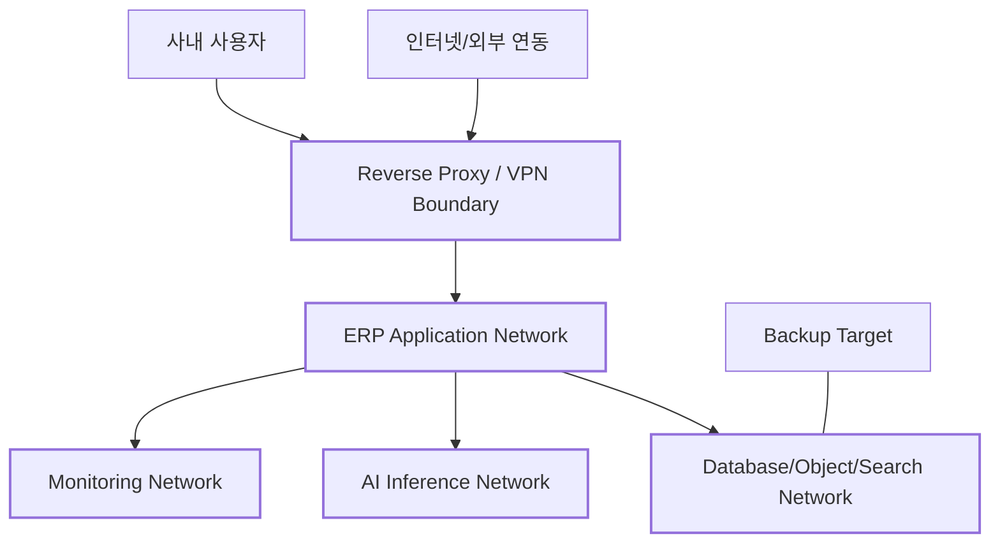

# 보안·권한·거버넌스 상세설계

## 1. 보안 목표

- 사용자와 서비스가 필요한 범위만 접근하도록 한다.
- 사내 서버 침해·계정 탈취·오설정·AI 오작동에 의한 데이터 노출을 줄인다.
- 중요 업무 변경은 승인과 감사로 추적한다.
- 백업을 포함한 데이터의 기밀성·무결성·가용성을 확보한다.
- 퇴사자·외부 협력자 접근을 즉시 회수할 수 있다.

## 2. 위협 모델

주요 위협:

- 약한 비밀번호와 계정 공유
- 관리자 권한 과다 부여
- 퇴사자/외부 협력자 계정 미회수
- 프로젝트 간 문서 권한 누출
- 잘못된 외부 공유 링크
- 파일 업로드를 통한 악성코드
- API 토큰/비밀키 유출
- 자체 서버 랜섬웨어·디스크 장애
- 백업이 같은 서버에만 존재
- 외부 연동 웹훅 위조
- AI 프롬프트 인젝션과 권한 우회
- 감사 로그 변조
- 운영자의 실수와 대량 삭제

## 3. 신뢰 경계



- DB, MinIO, Redis, Qdrant, OpenSearch는 인터넷에 직접 노출하지 않는다.
- 관리 포트는 VPN 또는 별도 관리망에서만 접근한다.
- AI 추론 서버는 업무 DB 직접 접근 권한을 갖지 않는다.
- 백업 대상은 운영 서버와 다른 장애 영역에 둔다.

## 4. 인증

### 4.1 사용자 인증

- 개인 계정 사용, 계정 공유 금지
- 강한 비밀번호 정책과 유출 비밀번호 차단
- 관리자·재무·인사·외부 접속은 MFA 권장 또는 강제
- 로그인 실패 속도 제한과 임시 잠금
- 비밀번호 재설정 토큰 짧은 만료
- 세션 목록과 원격 로그아웃
- 중요 변경 전 재인증 가능

### 4.2 서비스 인증

- 서비스 계정은 최소 권한
- 장기 공유 API 키보다 짧은 수명 토큰 또는 서명 방식 우선
- 토큰 원문은 생성 시 한 번만 표시
- 목적, 소유자, 만료일 필수
- 미사용 토큰 자동 경고/폐기

### 4.3 외부 사용자

- 스폰서 직원 필수
- 접근 프로젝트와 만료일 필수
- 기본 다운로드 제한 가능
- 계약 종료/프로젝트 종료 시 자동 만료 제안
- 내부 사용자와 시각적으로 구분

## 5. 권한 모델

### 5.1 RBAC + 제한적 ABAC

기본 역할 기반 권한(RBAC)에 범위와 조건을 추가한다.

- 역할: 대표, 관리자, PM, 직원, 영업, 경영지원, 외부 협력자
- 범위: 전사, 부서, 프로젝트, 본인, 명시 공유
- 조건: 금액 한도, 상태, 보안 등급, 본인 신청 여부

### 5.2 권한 판정 예

```text
ALLOW when
  permission = contract.read
  AND (
    role scope = company
    OR user is contract owner
    OR user is member of linked project with contract-view flag
  )
  AND document classification <= user's clearance
```

### 5.3 역할 분리

가능한 범위에서 다음 역할을 분리한다.

- 신청자와 최종 승인자
- 사용자 생성자와 관리자 권한 승인자
- 비용 입력자와 지급 확인자
- 자산 폐기 신청자와 승인자
- AI 도구 정의 관리자와 실행 승인자
- 백업 운영자와 복구 검증자

10명 이하 조직에서는 완전 분리가 어려울 수 있으므로, 예외는 사유와 로그를 남긴다.

## 6. 기본 역할 권한 매트릭스

표시는 `R` 조회, `C` 생성, `U` 수정, `A` 승인, `M` 관리다.

| 영역 | 대표 | 시스템 관리자 | PM | 직원 | 영업 | 경영지원 | 외부 |
|---|---|---|---|---|---|---|---|
| 전사 대시보드 | R | R | 제한 R | 제한 R | 제한 R | 제한 R | - |
| 사용자/권한 | 제한 R | M | - | - | - | - | - |
| CRM/영업 | R | R | 제한 R | 제한 R | M | 제한 R | - |
| 계약 | R/A | R | 프로젝트 R | 제한 R | C/U | C/U | 제한 R |
| 프로젝트 | R | R | M | 참여 C/U | 제한 R | 제한 R | 참여 R/U |
| 문서/산출물 | R | 메타 R | 프로젝트 M | 참여 C/U | 제한 C/U | 제한 C/U | 공유 범위 |
| 결재 | A | 설정 M | A | C | C | A/M | - |
| 비용/예산 | R/A | 메타 R | 프로젝트 R | 본인 C/R | 본인 C/R | M | - |
| HR | 요약 R | 계정 R | 팀 요약 R | 본인 R/U | 본인 R | M | - |
| 자산 | R | R | 프로젝트 R | 본인 R | R | M | 공유 자산 R |
| AI | 정책 범위 | 설정 M | 프로젝트 사용 | 개인/참여 사용 | 영업 사용 | 관리 사용 | 제한 사용 |
| 감사 로그 | 중요 R | M | 프로젝트 제한 | 본인 제한 | 본인 제한 | 재무 제한 | - |

실제 권한은 세부 permission code로 관리하고 이 표는 기본 템플릿이다.

## 7. 데이터 분류

| 등급 | 정의 | 예시 | 기본 통제 |
|---|---|---|---|
| PUBLIC | 공개 가능 | 공개 브로슈어 | 인증 불필요 가능 |
| INTERNAL | 일반 사내 | 업무, 일반 회의록 | 사내 인증 |
| CONFIDENTIAL | 제한 필요 | 계약, 견적, 고객 비공개 자료 | 프로젝트/역할 제한, 다운로드 감사 |
| RESTRICTED | 매우 민감 | 인사 민감정보, 계좌, 비밀 설정 | 암호화, MFA, 별도 역할, 상세 감사 |

사용자는 문서 생성 시 등급을 선택하며 프로젝트/문서 유형별 기본값을 자동 제안한다.

## 8. 암호화

### 8.1 전송

- 브라우저/API/스토리지/관리 접속 TLS
- 내부 서비스 간에도 가능한 범위에서 TLS 또는 격리 네트워크
- 인증서 만료 모니터링

### 8.2 저장

- 서버 디스크 또는 볼륨 암호화 권장
- RESTRICTED 필드는 애플리케이션 레벨 암호화
- 백업 암호화
- 비밀은 코드/DB 평문이 아닌 비밀 저장소
- 암호화 키와 데이터 백업 분리

### 8.3 키 관리

- 키 ID와 버전 관리
- 정기 회전 정책
- 퇴사/침해 시 긴급 회전
- 복구를 위한 키 백업을 안전하게 별도 보관
- 애플리케이션 로그에 키/토큰 출력 금지

## 9. 파일 보안

- 확장자와 MIME 검증
- 실행파일/스크립트 업로드 정책
- 악성코드 검사 후 READY 전환
- 압축 폭탄과 경로 순회 방지
- 미리보기 변환을 격리된 워커에서 수행
- 다운로드 시 `Content-Disposition`과 안전 헤더
- 외부 공유 링크 만료/비밀번호/횟수 제한
- 민감 문서 워터마크 선택
- 파일 체크섬과 변조 검증

## 10. API 보안

- 모든 endpoint별 권한 검사
- object-level authorization 필수
- 입력 스키마와 길이 제한
- SQL/명령/템플릿 인젝션 방지
- CSRF 정책(쿠키 세션 사용 시)
- CORS allowlist
- rate limiting
- idempotency와 replay 방지
- webhook 서명 검증
- 오류에서 내부 정보 미노출
- OpenAPI 관리자 endpoint 분리/제한

## 11. 감사 로깅

### 11.1 필수 감사 대상

- 로그인 성공/실패, MFA, 세션 철회
- 사용자/역할/권한 변경
- 계약/견적/결재/금액 상태 변경
- 인사 민감정보 열람·수정
- 문서 다운로드·외부 공유
- 대량 내보내기
- 자산 폐기/분실
- 백업/복구
- 외부 연동 설정/비밀 변경
- AI 도구 실행/승인/거절
- 감사 로그 조회 자체

### 11.2 로그 보호

- append-only
- 일반 앱 계정의 UPDATE/DELETE 금지
- 별도 보존/백업
- 시간 동기화
- 무결성 해시 체인 또는 외부 로그 저장 검토
- 원문 비밀정보는 마스킹

## 12. 보존·폐기·법적 보류

- 데이터 유형별 보존 정책
- 프로젝트 종료 후 보관 등급 결정
- 계약·재무·결재 문서는 장기 보존 정책 적용
- 법적 보류(legal hold) 시 자동 삭제 중지
- 폐기 예정 목록 사전 검토
- 폐기 작업은 승인과 결과 보고서
- 백업에 남아 있는 데이터의 만료 처리 정책 문서화

구체적인 법정 보존기간과 개인정보 처리 기준은 회사의 법무·노무·세무 검토를 거쳐 확정한다.

## 13. 개인정보 최소화

- 업무에 필요하지 않은 주민번호·계좌·건강정보 등은 수집하지 않음
- 민감정보는 별도 테이블/서비스로 분리
- 목록 화면 기본 마스킹
- 내보내기 권한 제한
- 테스트 환경에 실제 개인정보 복제 금지 또는 비식별화
- AI 외부 모델 전송 전 정책 검사

## 14. AI 보안 통제

- 사용자 권한 컨텍스트를 모든 검색/도구 호출에 전달
- 검색 색인과 원본 DB 이중 권한 확인
- 도구별 입력 스키마·허용 범위
- 중요 실행 승인
- 승인된 payload를 실행 전 변경할 수 없음
- 외부 문서의 프롬프트 인젝션 무시
- 비밀정보 탐지·마스킹
- 모델 제공자별 데이터 전송 정책
- 대화/실행 보존 기간
- 킬 스위치: 전체 AI, 특정 모델, 특정 도구 즉시 비활성화

## 15. 개발 보안(SDLC)

- 보호 브랜치와 PR 리뷰
- 의존성 잠금 파일
- SAST, secret scan, dependency scan
- 컨테이너 이미지 scan
- IaC/Compose 설정 검증
- 테스트용 기본 비밀번호 금지
- migration review
- 권한 테스트를 기능 테스트와 동일한 필수 게이트로 취급
- 운영 배포물에 debug endpoint 금지
- SBOM 생성 권장

## 16. 환경 분리

- 개발, 스테이징, 운영 분리
- 운영 데이터의 개발 환경 복제 금지
- 환경별 비밀과 외부 연동 분리
- 스테이징에서 이메일/메신저 외부 발송 차단 또는 안전 수신처로 전환
- 운영 관리자 접근은 별도 승인/로그

## 17. 네트워크 기준

- Reverse proxy만 사용자망에 노출
- DB/캐시/스토리지 검색 포트 비공개
- 운영 SSH는 VPN/allowlist/MFA 가능한 점프 호스트
- 방화벽 default deny
- 컨테이너 간 필요한 포트만 허용
- 외부 모델 API outbound allowlist 검토
- 관리 UI는 사내망/VPN 제한

## 18. 취약점/사고 대응

### 18.1 사고 등급

- SEV1: 대규모 데이터 유출, 전체 중단, 랜섬웨어
- SEV2: 중요 모듈 중단, 제한적 노출 가능성
- SEV3: 부분 기능 문제, 우회 가능
- SEV4: 낮은 영향의 결함

### 18.2 기본 절차

1. 탐지·기록
2. 접근 차단/격리
3. 증거 보존
4. 영향 범위 분석
5. 자격증명/키 회전
6. 복구
7. 관계자 통지와 법적 검토
8. 원인 분석 및 재발 방지

### 18.3 계정 침해 즉시 조치

- 사용자/토큰/세션 철회
- 관련 API·다운로드·권한 변경 감사 조회
- 비밀번호/MFA 재설정
- 외부 공유 링크 철회
- AI 실행 이력 확인

## 19. 정기 점검

| 주기 | 점검 |
|---|---|
| 매일 | 백업 성공, 중요 경보, 디스크, 인증서 |
| 매주 | 실패 로그인, 권한 변경, 외부 공유, AI 고위험 실행 |
| 매월 | 휴면/외부 계정, 토큰, 취약점, 패치, 복구 샘플 |
| 분기 | 권한 재인증, 복구 훈련, 관리자 계정 점검 |
| 연간 | 보안 정책·보존정책·사고대응 훈련 검토 |

## 20. 보안 수용 기준

- 권한 없는 프로젝트/문서 직접 URL 접근 차단
- 외부 사용자가 다른 프로젝트 ID를 바꿔도 조회 불가
- 관리자 권한 변경이 감사 로그에 남음
- RESTRICTED 필드가 로그/에러/내보내기에 노출되지 않음
- 백업 복구 후 권한과 감사 로그 유지
- AI가 권한 없는 자료를 인용하지 않음
- 승인 필요 도구가 승인 없이 실행되지 않음
- 웹훅 위조와 재전송이 차단됨
- 악성 업로드가 다운로드/인덱싱 전에 격리됨

---
