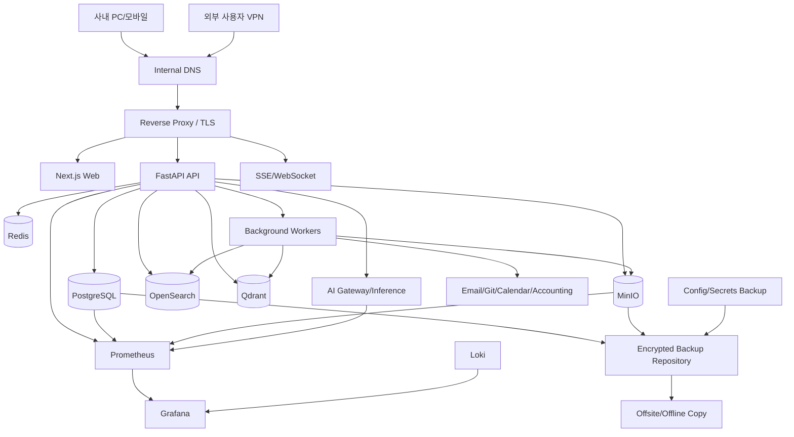

# 자체 서버 인프라·배포·운영 상세설계

## 1. 운영 목표

- 10명 이하, 최대 30명 사용자가 안정적으로 접속
- 사내 서버에서 핵심 데이터와 문서를 통제
- 검색·AI 장애와 핵심 ERP 장애를 분리
- 단일 서버 장애에 대비한 외부 백업
- 소규모 조직이 실제로 관리 가능한 복잡도 유지

## 2. 권장 배포 단계

### Stage 1: 단일 애플리케이션 서버 + 별도 백업

- Docker Compose
- Reverse proxy
- Web/API/Worker
- PostgreSQL
- Redis
- MinIO
- OpenSearch
- Qdrant
- 모니터링
- 선택적 로컬 LLM 서버
- NAS 또는 다른 물리 장비로 백업

초기 기준안이며 운영 단순성이 가장 중요하다.

### Stage 2: 데이터/AI 분리

부하 또는 장애 격리가 필요할 때:

- App 서버
- DB/Storage 서버 또는 NAS
- GPU AI 서버
- 독립 백업 장치

### Stage 3: 다중 노드/k3s

실제 무중단 요구, 여러 사무실, 서비스 확장 시에만 적용한다.

## 3. 논리 배치



## 4. 서버 자원 계획 기준

정확한 사양은 기존 문서 용량, 동시 AI 요청, 로컬 모델 크기를 조사한 후 확정한다. 기능별 자원 특성은 다음과 같다.

| 구성 | 주요 자원 | 비고 |
|---|---|---|
| Web/API | CPU, 메모리 | 30명 규모에서 비교적 작음 |
| PostgreSQL | 메모리, 빠른 NVMe | 무결성과 백업이 중요 |
| MinIO | 디스크 용량·내구성 | 문서 증가의 주된 요소 |
| OpenSearch | 메모리·디스크 | heap와 색인 용량 관리 |
| Qdrant | 메모리·NVMe | 청크/임베딩 규모에 영향 |
| OCR/STT | CPU/GPU | 비동기 워커로 제한 |
| LLM | GPU VRAM | ERP와 물리/논리 분리 권장 |
| Monitoring | 디스크 | 로그 보존 기간 관리 |

## 5. 스토리지 설계

### 5.1 볼륨 분리

- DB data/WAL
- MinIO objects
- Search index
- Vector index
- Application temporary files
- Logs
- Backups

운영 데이터와 백업을 같은 단일 디스크에 두지 않는다.

### 5.2 RAID와 백업 구분

RAID는 디스크 장애 가용성을 높이지만 백업이 아니다. 삭제, 랜섬웨어, 애플리케이션 오류, 화재에는 별도 백업이 필요하다.

### 5.3 용량 경보

- 70% 주의
- 80% 조치
- 90% 긴급

DB, 객체 저장소, 로그, 검색 인덱스를 각각 모니터링한다.

## 6. Docker Compose 서비스 그룹

```text
edge:
  reverse-proxy

application:
  web
  api
  worker-default
  worker-documents
  worker-integrations
  scheduler

core-data:
  postgres
  redis
  minio

search-ai:
  opensearch
  qdrant
  ai-gateway
  inference-server(optional/separate)

observability:
  prometheus
  grafana
  loki
  exporters

operations:
  backup-runner
  antivirus-scanner
```

운영 Compose는 개발 Compose와 분리하고, 이미지 버전을 명시적으로 고정한다.

## 7. 네트워크

- `edge` 네트워크: reverse proxy와 web/api
- `app` 네트워크: api, worker, data services
- `monitoring` 네트워크: exporters, monitoring
- 데이터 서비스는 host port를 노출하지 않음
- 관리 접속은 VPN 또는 SSH tunnel
- GPU 서버가 별도이면 방화벽으로 AI gateway 포트만 허용

## 8. 도메인·TLS

예시:

```text
erp.company.internal        사용자 ERP
admin.erp.company.internal  관리자 UI(선택)
monitor.company.internal    Grafana(관리망)
storage.company.internal    MinIO Console(관리망)
```

- 사내 DNS 사용
- 외부 접속은 VPN 권장
- 인증서 자동 갱신 또는 내부 CA 운영
- 외부 공개 포트 최소화

## 9. 환경 구성

### 9.1 개발

- 개발자 PC 또는 공유 개발 서버
- 샘플/가짜 데이터
- 이메일 sandbox
- 로컬 스토리지 가능

### 9.2 스테이징

- 운영과 유사한 구성
- 비식별 데이터
- 실제 마이그레이션/백업/복구/연동 테스트
- 외부 발송 안전장치

### 9.3 운영

- 제한된 관리자 접근
- 변경 승인과 배포 기록
- 운영 비밀 별도
- debug 비활성

## 10. 설정과 비밀

- 일반 설정: 버전 관리된 환경별 설정 파일
- 비밀: SOPS/Vault 계열 또는 안전한 비밀 저장소
- `.env` 원문을 Git에 커밋하지 않음
- 비밀은 컨테이너 환경변수 노출을 최소화하고 파일/secret mount 검토
- DB/MinIO/연동/모델 API 자격증명 분리
- 회전 절차 문서화

## 11. CI/CD

```mermaid
flowchart LR
  C[Commit/PR] --> L[Lint/Type Check]
  L --> T[Unit/Integration Test]
  T --> S[Security/Dependency Scan]
  S --> B[Build Immutable Images]
  B --> O[OpenAPI/Migration Check]
  O --> ST[Deploy Staging]
  ST --> E2E[E2E/Smoke/Backup Test]
  E2E --> A[Manual Production Approval]
  A --> P[Deploy Production]
  P --> V[Health Verification]
  V --> R[Release Record]
```



### 11.1 배포 원칙

- 이미지 태그에 commit SHA
- `latest` 운영 사용 금지
- DB migration과 앱 호환 순서 문서화
- 배포 전 자동 백업 또는 복구 지점
- smoke test 실패 시 롤백
- 배포 내용 ERP 릴리스 기록에 연결

## 12. DB 마이그레이션 운영

- migration 파일은 수정하지 않고 새 migration 추가
- destructive migration은 2단계: 확장 → 데이터 이관 → 제거
- 대용량 backfill은 비동기/배치
- 운영 전 스테이징 복제에서 수행시간 측정
- rollback 가능 여부 명시
- 각 모듈 migration 소유자 지정
- 동시 에이전트의 migration 번호 충돌 방지 규칙

## 13. 백업 전략

### 13.1 백업 대상

- PostgreSQL 전체/증분 또는 WAL
- MinIO 객체와 버전/메타데이터
- OpenSearch/Qdrant 스냅샷(재생성 가능 여부 고려)
- 설정, Compose, reverse proxy 설정
- 암호화 키/인증서의 안전한 백업
- 외부 연동 매핑
- 감사 로그

### 13.2 권장 3-2-1 원칙

- 3개 사본
- 2개 서로 다른 매체/장비
- 1개 오프사이트 또는 오프라인

### 13.3 예시 일정

- PostgreSQL: 매일 전체 + 더 짧은 간격의 증분/WAL 권장
- MinIO: 매일 증분/복제
- 설정: 변경 시 및 매일
- 검색/벡터: 주기적 스냅샷 또는 원문에서 재생성 절차
- 월 1회 장기 보존본

실제 주기는 RPO 요구와 저장공간을 근거로 확정한다.

### 13.4 백업 검증

백업 성공 로그만으로 충분하지 않다.

- 체크섬/목록 검증
- 주기적 샘플 복원
- 분기별 전체 복구 훈련
- 복구 시간 기록
- 암호화 키 복원 검증

## 14. 재해복구

### 14.1 우선순위

1. 인증/권한
2. PostgreSQL
3. MinIO 문서
4. Web/API
5. 결재/업무
6. 검색
7. AI/RAG
8. 외부 연동/분석

### 14.2 복구 절차 개요

1. 사고 범위와 복구 기준 시점 결정
2. 손상 환경 격리
3. 깨끗한 호스트 준비
4. 비밀/인증서 복원
5. PostgreSQL 복원 및 무결성 검사
6. MinIO 복원 및 DB 참조 검사
7. 애플리케이션 배포와 migration 확인
8. 검색/벡터 재구성 또는 복원
9. smoke/E2E 테스트
10. 사용자 개방
11. 누락된 외부 연동 재처리

## 15. 모니터링

### 15.1 시스템 메트릭

- CPU, 메모리, load
- 디스크 사용량/IO/SMART
- 네트워크
- GPU 사용률/VRAM/온도
- 컨테이너 재시작

### 15.2 애플리케이션 메트릭

- 요청 수, p50/p95/p99 latency
- 4xx/5xx 오류율
- 로그인 실패
- DB connection pool
- 작업 큐 길이/지연/실패
- outbox 미발행 수
- 파일 처리 시간/실패
- 검색 색인 지연
- AI run 수/latency/error/token
- 외부 연동 성공/실패

### 15.3 사용자 관점 점검

- 로그인
- 프로젝트 목록
- 업무 생성/조회
- 문서 다운로드
- 결재 조회
- 검색

synthetic smoke check를 주기적으로 실행한다.

## 16. 로그

### 16.1 구조화 로그 필드

- timestamp
- level
- service
- environment
- trace_id, span_id
- request_id
- user_id(필요 시 pseudonymous)
- module
- action
- status_code
- duration_ms
- error_code

비밀번호, 토큰, 문서 원문, 주민번호 등은 로그 금지.

### 16.2 보존

- 앱 로그: 운영 필요 기간
- 보안/감사 로그: 더 긴 정책
- 디버그 로그: 운영 기본 비활성
- 로그 용량과 개인정보를 함께 고려

## 17. 경보

### 긴급

- ERP 전체 접속 불가
- DB down/replication 또는 백업 실패 지속
- 디스크 90% 이상
- 데이터 무결성 오류
- 보안 침해 의심
- 인증서 임박/만료

### 주의

- p95 latency 상승
- 작업 큐 지연
- 검색 색인 지연
- AI 오류율 상승
- 외부 연동 반복 실패
- 디스크 80% 이상

경보는 소유자와 runbook 링크를 포함하고 중복을 억제한다.

## 18. 운영 작업

### 매일

- 대시보드와 경보 확인
- 백업 성공 확인
- 큐/연동 실패 확인
- 디스크 여유 확인

### 매주

- 패치/취약점 검토
- 실패 보관함 정리
- 외부 사용자/공유 링크 검토
- AI 고위험 실행 검토

### 매월

- OS/컨테이너/의존성 패치
- 샘플 복원
- 사용량/용량 추세
- 휴면 계정·토큰
- 성능 보고

### 분기

- 전체 복구 훈련
- 권한 재검토
- 보안 점검
- 용량 계획 갱신

## 19. 유지보수 모드

- 읽기 전용 모드 지원 검토
- 사용자에게 시작/종료 예정 공지
- 진행 중 업로드/AI 실행 처리
- migration 중 쓰기 차단 여부
- 관리자 우회 접근 기록

## 20. 운영 Runbook 목록

- ERP 접속 불가
- DB 용량 부족
- PostgreSQL 복구
- MinIO 객체 손상/복구
- 검색 재색인
- Qdrant 재구축
- 작업 큐 적체
- 이메일/Git/회계 연동 실패
- AI 모델 서버 장애
- 사용자 계정 침해
- 랜섬웨어 의심
- 인증서 만료
- 배포 롤백
- 외부 공유 긴급 철회

각 runbook은 증상, 확인 명령, 안전한 조치, 에스컬레이션, 복구 검증을 포함한다.

## 21. 운영 수용 기준

- 신규 서버에서 문서화된 절차로 전체 복구 가능
- 운영 데이터 없이도 스테이징 배포 가능
- DB/MinIO가 인터넷에 직접 노출되지 않음
- 중요 서비스와 백업의 상태가 대시보드에 표시
- 배포와 migration이 재현 가능
- 검색/AI를 중지해도 프로젝트·업무·결재 사용 가능
- 운영자 한 명이 장애 원인과 trace를 추적 가능
- 백업이 운영 서버와 다른 물리/논리 장애 영역에 존재

---
