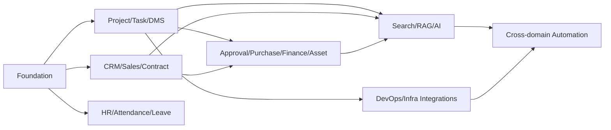

# 구축 로드맵 및 단계별 범위

## 1. 원칙

전체 모듈을 설계했지만 구현과 운영 전환은 단계별로 한다. 각 단계는 이전 단계의 데이터와 사용 습관을 기반으로 하며, 기능 개수보다 실제 사용 정착을 완료 조건으로 삼는다.

에이전트 병렬 개발은 가능하지만 다음 의존성을 무시하지 않는다.

## 2. Phase 0 — 기반과 개발 기준

### 목표

모든 이후 모듈이 공유하는 인증, 권한, 감사, 파일, 이벤트, 디자인 시스템, 배포 기반을 만든다.

### 범위

- 저장소 구조와 모듈 경계
- 개발/스테이징/운영 환경
- CI/CD와 품질 게이트
- 사용자·직원·부서
- 인증·세션·MFA 기반
- 역할·권한·범위
- 감사 로그/활동 로그
- 댓글/멘션/알림 기반
- MinIO 파일 업로드 기반
- outbox/worker/idempotency
- 공통 UI 레이아웃/컴포넌트
- 모니터링·로그·백업 최소구성

### 완료 기준

- 사용자 초대→로그인→권한별 화면 노출
- 임의 프로젝트 리소스에 대한 범위 권한 데모
- 파일 업로드/다운로드/검사
- 감사 로그와 trace 확인
- 신규 환경 배포 및 DB migration 재현
- 백업에서 샘플 복원

## 3. Phase 1 — 프로젝트 운영 코어

### 목표

회사의 현재 프로젝트 수행 업무를 ERP로 옮긴다.

### 범위

- 프로젝트/멤버/템플릿
- 마일스톤/업무/하위업무/의존성
- 칸반/목록/간트 기초
- 일정/회의/회의록 수동 기능
- 문서/버전/폴더
- 산출물 계획/검토/제출
- 리스크/이슈/의사결정
- 프로젝트 대시보드/활동 타임라인
- 기본 전자결재(일반 품의)
- 주간보고 수동 템플릿

### 운영 전환 범위

신규 프로젝트 1~2개를 시범 운영하고 기존 공유폴더와 업무표를 병행 검증한다.

### 완료 기준

- 프로젝트 템플릿으로 업무·산출물 생성
- 회의 액션을 수동으로 업무 전환
- 승인본/제출본 버전 추적
- PM이 별도 스프레드시트 없이 주간 현황 작성 가능
- 외부 협력자 프로젝트 제한 접근 검증

## 4. Phase 2 — CRM·영업·견적·계약

### 목표

수주 전 정보와 프로젝트 개시를 연결한다.

### 범위

- 고객사/담당자/활동
- 리드/영업기회/파이프라인
- 견적 품목/버전/결재/PDF
- 계약/버전/의무/갱신
- 지급 일정
- 수주→프로젝트 전환
- 영업/계약 대시보드

### 완료 기준

- 고객 중복 방지
- 견적 승인본과 발송 이력
- 활성 계약에서 프로젝트 생성
- 계약 의무와 산출물 연결
- 갱신 예정 알림

## 5. Phase 3 — 결재·구매·비용·자산·손익

### 목표

프로젝트 수행 비용과 회사 자산을 연결하고 처리 상태를 투명하게 한다.

### 범위

- 결재 양식/조건/대결/SLA
- 구매요청/견적비교/발주/입고
- 비용/증빙/배부/외부 회계 내보내기
- 프로젝트 예산
- 매출/수금/매입/지급 상태
- 자산/대여/점검/폐기
- 소모품 재고
- 프로젝트 손익

### 완료 기준

- 구매요청→결재→발주→입고→자산 흐름
- 비용→프로젝트 예산/손익 반영
- 초과 예산 경고
- 자산 보유자/위치 추적
- 외부 회계 내보내기 검증

## 6. Phase 4 — 인사·근태·휴가

### 목표

소규모 조직의 기본 인사 운영과 프로젝트 인력 정보를 연결한다.

### 범위

- 직원/조직도 고도화
- 출퇴근/근태 수정
- 휴가 부여/잔여/신청
- 팀 일정 반영
- 기술/자격/교육
- 평가 기초
- 퇴사 체크리스트와 자산/권한 회수

### 완료 기준

- 휴가 잔여와 승인 일관성
- 퇴사 시 세션·권한 회수
- 자산과 미완료 업무 인계 목록
- 민감정보 권한/감사 검증

## 7. Phase 5 — 검색·지식·AI 1차

### 목표

사내 정보를 안전하게 검색하고 반복 문서 작성 시간을 줄인다.

### 범위

- OpenSearch 통합 검색
- Qdrant 기반 권한 RAG
- 위키/FAQ
- AI 워크스페이스
- 프로젝트/회의/문서 요약
- 주간보고 초안
- 회의 액션아이템 제안
- 산출물 누락 점검
- AI 실행/평가 로그

초기에는 읽기와 초안 중심이다.

### 완료 기준

- 원문 인용과 권한 필터
- 구버전/다른 프로젝트 문서 미노출
- 회의 액션 제안 정확도 검토
- 보고서 초안에서 근거 추적
- 외부 모델 전송 정책 검증

## 8. Phase 6 — 승인형 에이전트 자동화

### 목표

AI가 ERP 메뉴를 대신 조작하되, 통제 가능한 방식으로 실행한다.

### 범위

- Tool Gateway
- 위험 등급/승인 정책
- 업무/리스크/문서 검토 요청 도구
- 계약→프로젝트 제안
- 회의→업무 승인형 생성
- 입고→자산 초안
- 계약 갱신 대응 워크플로우
- AI 승인 대기/실행 이력

### 완료 기준

- 승인 전 중요 변경 0건
- 중복 실행 방지
- 실행 결과 링크/감사
- 도구 비활성화/킬 스위치
- 프롬프트 인젝션 테스트 통과

## 9. Phase 7 — 개발·인프라·외부 연동 고도화

### 범위

- GitHub/GitLab webhook
- 이슈/PR/배포 연결
- 이메일/캘린더
- 회계/전자서명 연동
- 서버/GPU/서비스 상태
- 장애/포스트모템
- 정기 리포트 자동 생성

### 완료 기준

- 외부 연동 실패가 핵심 업무를 막지 않음
- 중복 webhook 처리 없음
- 연동 매핑/오류 재처리 가능
- 장애와 프로젝트/자산/서비스 연결

## 10. MVP와 전체 설계의 구분

### MVP 운영 필수

- 인증/권한/감사
- 프로젝트/업무/일정
- 문서/산출물
- 일반 결재
- 알림/검색 기초
- 백업/복구

### 전체 제품 필수지만 후순위

- CRM/영업/계약
- 구매/비용/자산
- HR
- RAG/AI
- DevOps/인프라 연동

### 보류 가능

- 완전한 메신저
- 네이티브 앱
- 복잡한 자원 최적화
- 다중 법인/다국가
- 자체 급여/법정회계
- Kubernetes

## 11. 병렬 에이전트 작업 스트림

### Stream A — Platform

IAM, 권한, 감사, 파일, 이벤트, 알림, 공통 API.

### Stream B — Project

프로젝트, 업무, 일정, 회의, 리스크, 산출물.

### Stream C — Commercial

CRM, 영업, 견적, 계약.

### Stream D — Operations

결재, 구매, 비용, 예산, 자산, 재고.

### Stream E — People

직원, 근태, 휴가, 교육.

### Stream F — AI/Search

검색, RAG, 에이전트, 도구, 평가.

### Stream G — Integrations/Infra

Git, 이메일, 캘린더, 회계, 모니터링, 배포.

### Stream H — UX/QA

디자인 시스템, 접근성, E2E, 권한 회귀, 문서.

Platform 계약이 안정되기 전 다른 스트림은 mock 계약으로 작업하되 DB를 임의 생성하지 않는다.

## 12. 단계별 데이터 이관

### 1차

- 직원/부서
- 진행 중 프로젝트
- 프로젝트 멤버
- 핵심 업무/마일스톤
- 최신 산출물과 제출본

### 2차

- 고객/담당자
- 진행 영업기회
- 유효 계약

### 3차

- 자산
- 진행 구매/비용
- 예산

과거 전체 자료를 무조건 구조화 이관하지 않는다. 오래된 문서는 읽기 전용 아카이브로 먼저 연결한 뒤 필요 시 구조화한다.

## 13. 사용자 정착 계획

- 프로젝트 1~2개 파일럿
- 역할별 30~60분 교육
- 기존 프로세스와 ERP 절차 비교표
- 초기 2주 일일 피드백
- 입력이 어려운 필드 제거/자동화
- 관리자 1명, 업무 운영자 1명 지정
- 도움말과 짧은 동영상/스크린샷
- 사용률이 낮은 기능은 강제하지 않고 원인 확인

## 14. 단계 종료 검토

각 Phase 종료 시 다음 질문에 답한다.

- 실제 사용자가 반복 사용했는가?
- 기존 스프레드시트/메신저 업무가 줄었는가?
- 데이터 품질이 유지되는가?
- 권한과 감사가 검증됐는가?
- 백업/복구 가능한가?
- 다음 단계가 현재 구조를 깨지 않고 추가 가능한가?
- 미사용 기능을 제거하거나 단순화할 부분은 없는가?

## 15. 롤아웃 원칙

- 모듈별 feature flag
- 읽기 전용 파일럿 → 제한 쓰기 → 전사 쓰기
- 이전 시스템과 병행 기간 명시
- 롤백 시 데이터 손실 방지
- 운영 전환일과 책임자 기록
- 사용 중단 기준과 비상 연락체계

---
